# Kamus Data V@LIDSAMSAT

## ERD

```mermaid
erDiagram
    APPGROUPUSER {
        varchar kdgroup PK
        varchar nmgroup
        varchar ket
    }
    APPOTOR {
        varchar kdgroup FK
        varchar roleid FK
        varchar ket
    }
    APPROLE {
        varchar roleid PK
        bigint idapp
    }
    APPUSER {
        varchar userid PK
        bigint idupt FK
        varchar kdgroup FK
    }
    JNSDOK {
        varchar kddok PK
    }
    JNSGOLONGAN {
        char jnsgolid PK
        char katid FK
        char jnskendid FK
    }
    JNSGUNA {
        varchar kdguna PK
    }
    JNSHIST {
        char kdhist PK
        char kdflow FK
    }
    JNSJR {
        char jnsjrid PK
    }
    JNSKATKENDARAAN {
        char katid PK
    }
    JNSKENDARAAN {
        char jnskendid PK
        char katid FK
        char jnsjrid FK
    }
    JNSMILIK {
        varchar kdmilik PK
    }
    JNSPAJAK {
        varchar kdjnspjk PK
    }
    JNSPLAT {
        varchar kdplat PK
    }
    JNSPROGRESIF {
        int kdprogresif PK
    }
    JNSRANMOR {
        char kdranmor PK
    }
    JNSSTRUREK {
        char mtglevel PK
    }
    JNSTARIF {
        char kdjnstarif PK
        char jnskendid FK
    }
    JNSUMUM {
        char kdumum PK
    }
    MAPJNSPENDAPATAN {
        int idmapjnsd PK
    }
    MASTERAB {
        bigint idab PK
        bigint idktp FK
        bigint idkabkokta FK
        bigint idkecamatan FK
        bigint idkelurahan FK
        int idrw FK
        int idrt FK
        char jnskendid FK
        int idmerk FK
        varchar kdmilik FK
        varchar kdguna FK
        varchar kdplat FK
    }
    MASTERABDET {
        bigint idabdet PK
        bigint idab FK
        int idjnsd FK
    }
    MASTERBADAN {
        bigint idbadan PK
        bigint idktp FK
        bigint idprovinsi FK
        bigint idkabkokta FK
    }
    MASTERBANK {
        int idbank PK
    }
    MASTERBBM {
        varchar kodebbm PK
    }
    MASTERBENDAHARA {
        bigint idbend PK
        bigint idpegawai FK
        int idbank FK
        int idreknrc FK
    }
    MASTERFLOW {
        varchar kdflow PK
    }
    MASTERHAPUSDENDA {
        int idhapusdenda PK
    }
    MASTERHISTORY {
        bigint idhistory PK
        bigint idwp FK
        bigint idktp FK
        char jnskendid FK
        int idmerk FK
        varchar kdmilik FK
        varchar kdguna FK
        varchar kdplat FK
    }
    MASTERJABTTD {
        bigint idjabttd PK
        varchar kddok FK
    }
    MASTERJNSPENDAPATAN {
        int idjnsd PK
        int parentid FK
    }
    MASTERKABKOTA {
        bigint idkabkota PK
        bigint idprovinsi FK
    }
    MASTERKABKOTAALL {
        bigint idkabkotaall PK
        bigint idprovinsi FK
    }
    MASTERKAUPT {
        bigint idkaupt PK
        bigint idpegawai FK
        bigint idupt FK
    }
    MASTERKB {
        bigint idkb PK
        bigint idktp FK
        bigint idkabkokta FK
        bigint idkecamatan FK
        bigint idkelurahan FK
        int idrw FK
        int idrt FK
        char jnskendid FK
        int idmerk FK
        varchar kdmilik FK
        varchar kdguna FK
        varchar kdplat FK
    }
    MASTERKBDET {
        bigint idkbdet PK
        bigint idkb FK
        int idjnsd FK
    }
    MASTERKECAMATAN {
        bigint idkecamatan PK
        bigint idkabkota FK
    }
    MASTERKELURAHAN {
        bigint idkelurahan PK
        bigint idkecamatan FK
    }
    MASTERKIOSK {
        int idkios PK
        int idparent FK
    }
    MASTERKTP {
        bigint idktp PK
        bigint idkabkokta FK
        bigint idkecamatan FK
        bigint idkelurahan FK
    }
    MASTERLIBUR {
        int idlibur PK
        bigint idkabkota FK
    }
    MASTERMERK {
        int idmerk PK
    }
    MASTERNPWPD {
        bigint idnpwpd PK
        bigint idbadan FK
        bigint idktp FK
    }
    MASTERPEGAWAI {
        bigint idpegawai PK
        bigint idktp FK
        bigint idupt FK
    }
    MASTERPROVINSI {
        bigint idprovinsi PK
    }
    MASTERREKD {
        int idrekd PK
        varchar kdjnspjk FK
    }
    MASTERREKNRC {
        int idreknrc PK
    }
    MASTERRT {
        int idrt PK
        int idrw FK
    }
    MASTERRW {
        int idrw PK
        bigint idkelurahan FK
    }
    MASTERTARIF {
        bigint idtarif PK
        varchar kdjnspjk FK
        char jnskendid FK
        varchar kdflow FK
        varchar kdplat FK
    }
    MASTERTARIFNJOP {
        bigint idtarifnjop PK
        bigint iduunjop FK
        int idrekd FK
        char kdjnstarif FK
        int idmerk FK
    }
    MASTERTEKS {
        int idteks PK
    }
    MASTERUPT {
        bigint idupt PK
        int idbank FK
        bigint idkabkota FK
    }
    MASTERUUNJOP {
        bigint iduunjop PK
    }
    MASTERWP {
        bigint idwp PK
        bigint idktp FK
        bigint idkabkokta FK
        bigint idkecamatan FK
        bigint idkelurahan FK
        int idrw FK
        int idrt FK
        char jnskendid FK
        int idmerk FK
        varchar kdmilik FK
        varchar kdguna FK
        varchar kdplat FK
    }
    MASTERWPDATA {
        bigint idwpdata PK
        int idjnsd FK
        bigint idwp FK
    }
    TRANSDATAKOHIR {
        bigint idkohir PK
        bigint idwp FK
        bigint idupt FK
    }
    TRANSHISTPENDATAAN {
        bigint idhistpendataan PK
        bigint idwpdata FK
    }
    TRANSHISTPENDATAANDET {
        bigint idhistpendataandet PK
        bigint idhistpendataan FK
        bigint idpenetapan FK
    }
    TRANSHISTPENETAPAN {
        bigint idhistpenetapan PK
        bigint idkohir FK
        bigint idwpdata FK
    }
    TRANSPENDATAAN {
        bigint idpendataan PK
        bigint idwpdata FK
    }
    TRANSPENDATAANDET {
        bigint idpendataandet PK
        bigint idpendataan FK
        bigint idpenetapan FK
    }
    TRANSPENETAPAN {
        bigint idpenetapan PK
        bigint idkohir FK
        bigint idwpdata FK
    }
    TRANSSTS {
        bigint idsts PK
        bigint idupt FK
        bigint idbend FK
    }
    TRANSSTSDET {
        bigint idstsdet PK
        bigint idsts FK
        int idrekd FK
    }
    TRANSWPDATA {
        bigint idtwpdata PK
        bigint idnpwpd FK
    }
    TRANSWPDATAANTRI {
        int idantri PK
        bigint idtwpdata FK
        bigint idktp FK
    }
    TRANSWPDATAFILE {
        bigint idfile PK
        bigint idtwpdata FK
    }
    REF_FLAG {
        char flag_code PK
    }

    APPGROUPUSER ||--o{ APPOTOR : has
    APPROLE ||--o{ APPOTOR : has
    APPGROUPUSER ||--o{ APPUSER : has
    JNSKATKENDARAAN ||--o{ JNSKENDARAAN : contains
    JNSJR ||--o{ JNSKENDARAAN : classifies
    MASTERPROVINSI ||--o{ MASTERKABKOTA : contains
    MASTERPROVINSI ||--o{ MASTERKABKOTAALL : contains
    MASTERKABKOTA ||--o{ MASTERKECAMATAN : contains
    MASTERKECAMATAN ||--o{ MASTERKELURAHAN : contains
    MASTERKELURAHAN ||--o{ MASTERRW : contains
    MASTERRW ||--o{ MASTERRT : contains
    MASTERKABKOTA ||--o{ MASTERKTP : contains
    MASTERKTP ||--o{ MASTERBADAN : owns
    MASTERKTP ||--o{ MASTERAB : owns
    MASTERKTP ||--o{ MASTERKB : owns
    MASTERKTP ||--o{ MASTERWP : owns
    MASTERKTP ||--o{ MASTERHISTORY : owns
    MASTERKABKOTA ||--o{ MASTERAB : located
    MASTERKECAMATAN ||--o{ MASTERAB : located
    MASTERKELURAHAN ||--o{ MASTERAB : located
    MASTERRW ||--o{ MASTERAB : located
    MASTERRT ||--o{ MASTERAB : located
    MASTERKABKOTA ||--o{ MASTERKB : located
    MASTERKECAMATAN ||--o{ MASTERKB : located
    MASTERKELURAHAN ||--o{ MASTERKB : located
    MASTERRW ||--o{ MASTERKB : located
    MASTERRT ||--o{ MASTERKB : located
    MASTERKABKOTA ||--o{ MASTERWP : located
    MASTERKECAMATAN ||--o{ MASTERWP : located
    MASTERKELURAHAN ||--o{ MASTERWP : located
    MASTERRW ||--o{ MASTERWP : located
    MASTERRT ||--o{ MASTERWP : located
    JNSKENDARAAN ||--o{ MASTERAB : vehicle
    JNSKENDARAAN ||--o{ MASTERKB : vehicle
    JNSKENDARAAN ||--o{ MASTERWP : vehicle
    JNSKENDARAAN ||--o{ MASTERHISTORY : vehicle
    MASTERMERK ||--o{ MASTERAB : brand
    MASTERMERK ||--o{ MASTERKB : brand
    MASTERMERK ||--o{ MASTERWP : brand
    MASTERMERK ||--o{ MASTERHISTORY : brand
    JNSMILIK ||--o{ MASTERAB : ownership
    JNSMILIK ||--o{ MASTERKB : ownership
    JNSMILIK ||--o{ MASTERWP : ownership
    JNSMILIK ||--o{ MASTERHISTORY : ownership
    JNSGUNA ||--o{ MASTERAB : usage
    JNSGUNA ||--o{ MASTERKB : usage
    JNSGUNA ||--o{ MASTERWP : usage
    JNSGUNA ||--o{ MASTERHISTORY : usage
    JNSPLAT ||--o{ MASTERAB : plate
    JNSPLAT ||--o{ MASTERKB : plate
    JNSPLAT ||--o{ MASTERWP : plate
    JNSPLAT ||--o{ MASTERHISTORY : plate
    JNSDOK ||--o{ MASTERJABTTD : document
    MASTERBANK ||--o{ MASTERBENDAHARA : bank
    MASTERREKNRC ||--o{ MASTERBENDAHARA : account
    MASTERPEGAWAI ||--o{ MASTERBENDAHARA : employee
    MASTERPEGAWAI ||--o{ MASTERKAUPT : officer
    MASTERUPT ||--o{ MASTERKAUPT : office
    MASTERUPT ||--o{ MASTERPEGAWAI : office
    MASTERUPT ||--o{ TRANSDATAKOHIR : office
    MASTERUPT ||--o{ TRANSSTS : office
    MASTERBANK ||--o{ MASTERUPT : bank
    MASTERKABKOTA ||--o{ MASTERUPT : region
    MASTERJNSPENDAPATAN ||--o{ MASTERABDET : income
    MASTERJNSPENDAPATAN ||--o{ MASTERKBDET : income
    MASTERJNSPENDAPATAN ||--o{ MASTERWPDATA : income
    MASTERJNSPENDAPATAN ||--o{ MASTERJNSPENDAPATAN : parent
    MASTERWPDATA ||--o{ TRANSPENDATAAN : data
    MASTERWPDATA ||--o{ TRANSHISTPENDATAAN : history
    MASTERWPDATA ||--o{ TRANSHISTPENETAPAN : history
    MASTERWPDATA ||--o{ TRANSPENETAPAN : data
    MASTERWPDATA ||--o{ TRANSPENDATAAN : data
    TRANSDATAKOHIR ||--o{ TRANSPENETAPAN : kohir
    TRANSDATAKOHIR ||--o{ TRANSHISTPENETAPAN : kohir
    TRANSPENETAPAN ||--o{ TRANSPENDATAANDET : detail
    TRANSPENETAPAN ||--o{ TRANSHISTPENDATAANDET : detail
    TRANSHISTPENDATAAN ||--o{ TRANSHISTPENDATAANDET : detail
    TRANSPENDATAAN ||--o{ TRANSPENDATAANDET : detail
    MASTERWP ||--o{ MASTERHISTORY : history
    MASTERWP ||--o{ MASTERWPDATA : data
    MASTERWP ||--o{ TRANSDATAKOHIR : kohir
    MASTERBADAN ||--o{ MASTERNPWPD : registration
    MASTERKTP ||--o{ TRANSWPDATAANTRI : queue
    MASTERNPWPD ||--o{ TRANSWPDATA : registration
    TRANSWPDATA ||--o{ TRANSWPDATAANTRI : queue
    TRANSWPDATA ||--o{ TRANSWPDATAFILE : file
    MASTERREKD ||--o{ TRANSSTSDET : revenue
    JNSPAJAK ||--o{ MASTERREKD : tax
    JNSPAJAK ||--o{ MASTERTARIF : tax
    MASTERFLOW ||--o{ MASTERTARIF : flow
    JNSKENDARAAN ||--o{ MASTERTARIF : vehicle
    JNSPLAT ||--o{ MASTERTARIF : plate
    MASTERUUNJOP ||--o{ MASTERTARIFNJOP : rule
    MASTERREKD ||--o{ MASTERTARIFNJOP : revenue
    JNSTARIF ||--o{ MASTERTARIFNJOP : tariff
    MASTERMERK ||--o{ MASTERTARIFNJOP : brand
    REF_FLAG ||--o{ JNSGOLONGAN : flag
    REF_FLAG ||--o{ JNSHIST : flag
    REF_FLAG ||--o{ JNSKATKENDARAAN : flag
    REF_FLAG ||--o{ JNSMILIK : flag
    REF_FLAG ||--o{ JNSRANMOR : flag
    REF_FLAG ||--o{ JNSTARIF : flag
    REF_FLAG ||--o{ JNSUMUM : flag
    REF_FLAG ||--o{ MASTERBANK : flag
    REF_FLAG ||--o{ MASTERBENDAHARA : flag
    REF_FLAG ||--o{ MASTERFLOW : flag
    REF_FLAG ||--o{ MASTERHAPUSDENDA : flag
    REF_FLAG ||--o{ MASTERHISTORY : flag
    REF_FLAG ||--o{ MASTERJABTTD : flag
    REF_FLAG ||--o{ MASTERJNSPENDAPATAN : flag
    REF_FLAG ||--o{ MASTERKABKOTA : flag
    REF_FLAG ||--o{ MASTERKABKOTAALL : flag
    REF_FLAG ||--o{ MASTERKECAMATAN : flag
    REF_FLAG ||--o{ MASTERKELURAHAN : flag
    REF_FLAG ||--o{ MASTERKIOSK : flag
    REF_FLAG ||--o{ MASTERKTP : flag
    REF_FLAG ||--o{ MASTERMERK : flag
    REF_FLAG ||--o{ MASTERNPWPD : flag
    REF_FLAG ||--o{ MASTERPEGAWAI : flag
    REF_FLAG ||--o{ MASTERPROVINSI : flag
    REF_FLAG ||--o{ MASTERREKD : flag
    REF_FLAG ||--o{ MASTERRT : flag
    REF_FLAG ||--o{ MASTERRW : flag
    REF_FLAG ||--o{ MASTERTARIFNJOP : flag
    REF_FLAG ||--o{ MASTERTEKS : flag
    REF_FLAG ||--o{ MASTERUPT : flag
    REF_FLAG ||--o{ MASTERUUNJOP : flag
    REF_FLAG ||--o{ MASTERWP : flag
    REF_FLAG ||--o{ MASTERAB : flag
    REF_FLAG ||--o{ MASTERKB : flag
    REF_FLAG ||--o{ TRANSDATAKOHIR : flag
    REF_FLAG ||--o{ TRANSHISTPENDATAAN : flag
    REF_FLAG ||--o{ TRANSHISTPENDATAANDET : flag
    REF_FLAG ||--o{ TRANSHISTPENETAPAN : flag
    REF_FLAG ||--o{ TRANSPENDATAAN : flag
    REF_FLAG ||--o{ TRANSPENDATAANDET : flag
    REF_FLAG ||--o{ TRANSPENETAPAN : flag
    REF_FLAG ||--o{ TRANSSTS : flag
    REF_FLAG ||--o{ TRANSWPDATAANTRI : flag
```

Dokumen ini berisi daftar tabel dan kolom berdasarkan `db/V@LIDSAMSAT.sql`.

## Tabel `appgroupuser`

| Kolom | Tipe | Null | Default | Keterangan |
| --- | --- | --- | --- | --- |
| kdgroup | character varying(30) | NOT NULL |  | Kode grup. |
| nmgroup | character varying(50) | NOT NULL |  | Nama grup. |
| ket | character varying(100) | NULL |  | Keterangan tambahan. |
| created_at | timestamptz | NOT NULL | now() | Tanggal pembuatan data. |
| created_by | character varying(50) | NULL |  | Pengguna yang membuat data. |
| updated_at | timestamptz | NOT NULL | now() | Tanggal pembaruan data. |
| updated_by | character varying(50) | NULL |  | Pengguna yang memperbarui data. |

## Tabel `appotor`

| Kolom | Tipe | Null | Default | Keterangan |
| --- | --- | --- | --- | --- |
| kdgroup | character varying(30) | NOT NULL |  | Kode grup. |
| roleid | character varying(50) | NOT NULL |  | ID role. |
| ket | character varying(100) | NULL |  | Keterangan tambahan. |
| created_at | timestamptz | NOT NULL | now() | Tanggal pembuatan data. |
| created_by | character varying(50) | NULL |  | Pengguna yang membuat data. |
| updated_at | timestamptz | NOT NULL | now() | Tanggal pembaruan data. |
| updated_by | character varying(50) | NULL |  | Pengguna yang memperbarui data. |

## Tabel `approle`

| Kolom | Tipe | Null | Default | Keterangan |
| --- | --- | --- | --- | --- |
| roleid | character varying(50) | NOT NULL |  | ID role. |
| idapp | bigint | NULL |  | ID aplikasi. |
| role | character varying(254) | NULL |  | Nama peran/role. |
| role_type | character(2) | NULL |  | Tipe/kategori data. |
| menuid | character varying(50) | NULL |  | ID menu terkait. |
| parentid | character varying(50) | NULL |  | ID parent/hirarki. |
| bantuan | character varying(254) | NULL |  | Teks bantuan/keterangan menu. |
| link | character varying(254) | NULL |  | Tautan/URL menu. |
| icon | character varying(254) | NULL |  | Ikon menu. |
| kdlevel | integer | NULL |  | Kode level. |
| is_show | integer | NULL |  | Penanda tampil/tidak tampil. |
| created_at | timestamptz | NOT NULL | now() | Tanggal pembuatan data. |
| created_by | character varying(50) | NULL |  | Pengguna yang membuat data. |
| updated_at | timestamptz | NOT NULL | now() | Tanggal pembaruan data. |
| updated_by | character varying(50) | NULL |  | Pengguna yang memperbarui data. |

## Tabel `appuser`

| Kolom | Tipe | Null | Default | Keterangan |
| --- | --- | --- | --- | --- |
| userid | character varying(50) | NOT NULL |  | ID pengguna. |
| idupt | bigint | NULL |  | ID UPT. |
| kdtahap | character(5) | NOT NULL |  | Kode tahap. |
| pwd | character varying(200) | NULL |  | Password pengguna (terenkripsi). |
| idpeg | bigint | NULL |  | ID pegawai. |
| kdgroup | character varying(30) | NOT NULL |  | Kode grup. |
| nik | character varying(50) | NULL |  | Nomor Induk Kependudukan. |
| nama | character varying(100) | NULL |  | Nama lengkap. |
| email | character varying(50) | NULL |  | Alamat email. |
| created_at | timestamptz | NOT NULL | now() | Tanggal pembuatan data. |
| created_by | character varying(50) | NULL |  | Pengguna yang membuat data. |
| updated_at | timestamptz | NOT NULL | now() | Tanggal pembaruan data. |
| updated_by | character varying(50) | NULL |  | Pengguna yang memperbarui data. |

## Tabel `jnsdok`

| Kolom | Tipe | Null | Default | Keterangan |
| --- | --- | --- | --- | --- |
| kddok | character varying(10) | NOT NULL |  | Kode dokumen. |
| namadok | character varying(30) | NOT NULL |  | Nama dokumen. |
| keterangan | character varying(200) | NULL |  | Keterangan tambahan. |
| created_at | timestamptz | NOT NULL | now() | Tanggal pembuatan data. |
| created_by | character varying(50) | NULL |  | Pengguna yang membuat data. |
| updated_at | timestamptz | NOT NULL | now() | Tanggal pembaruan data. |
| updated_by | character varying(50) | NULL |  | Pengguna yang memperbarui data. |

## Tabel `jnsgolongan`

| Kolom | Tipe | Null | Default | Keterangan |
| --- | --- | --- | --- | --- |
| jnsgolid | character(2) | NOT NULL |  | Kode jenis golongan. |
| golongan | character varying(30) | NOT NULL |  | Golongan. |
| katid | character(1) | NULL |  | ID kategori. |
| jnskendid | character(3) | NULL |  | Kode jenis kendaraan. |
| viewall | character(1) | NULL |  | Penanda akses lihat semua. |
| status | character(1) | NULL |  | Status data/record. |
| created_at | timestamptz | NOT NULL | now() | Tanggal pembuatan data. |
| created_by | character varying(50) | NULL |  | Pengguna yang membuat data. |
| updated_at | timestamptz | NOT NULL | now() | Tanggal pembaruan data. |
| updated_by | character varying(50) | NULL |  | Pengguna yang memperbarui data. |

## Tabel `jnsguna`

| Kolom | Tipe | Null | Default | Keterangan |
| --- | --- | --- | --- | --- |
| kdguna | character varying(2) | NOT NULL |  | Kode jenis guna. |
| guna | character varying(30) | NOT NULL |  | Nama guna. |
| gunaplat | character varying(2) | NULL |  | Kode plat guna. |
| progresif | numeric(18,2) | NULL |  | Nilai progresif. |
| groupbpkb | character varying(20) | NOT NULL |  | Kelompok BPKB. |
| created_at | timestamptz | NOT NULL | now() | Tanggal pembuatan data. |
| created_by | character varying(50) | NULL |  | Pengguna yang membuat data. |
| updated_at | timestamptz | NOT NULL | now() | Tanggal pembaruan data. |
| updated_by | character varying(50) | NULL |  | Pengguna yang memperbarui data. |

## Tabel `jnshist`

| Kolom | Tipe | Null | Default | Keterangan |
| --- | --- | --- | --- | --- |
| kdhist | character(3) | NOT NULL |  | Kode histori. |
| nmhist | character varying(50) | NOT NULL |  | Nama histori. |
| kdflow | character(2) | NULL |  | Kode alur/proses. |
| status | character(1) | NULL |  | Status data/record. |
| created_at | timestamptz | NOT NULL | now() | Tanggal pembuatan data. |
| created_by | character varying(50) | NULL |  | Pengguna yang membuat data. |
| updated_at | timestamptz | NOT NULL | now() | Tanggal pembaruan data. |
| updated_by | character varying(50) | NULL |  | Pengguna yang memperbarui data. |

## Tabel `jnsjr`

| Kolom | Tipe | Null | Default | Keterangan |
| --- | --- | --- | --- | --- |
| jnsjrid | character(2) | NOT NULL |  | Kode jenis JR. |
| kodejr | character varying(2) | NOT NULL |  | Kode JR. |
| goljns | character varying(2) | NOT NULL |  | Golongan jenis. |
| pu | character varying(2) | NOT NULL |  | Penanda P/U. |
| roda | integer | NOT NULL |  | Jumlah roda. |
| keterangan | character varying(200) | NULL |  | Keterangan tambahan. |
| created_at | timestamptz | NOT NULL | now() | Tanggal pembuatan data. |
| created_by | character varying(50) | NULL |  | Pengguna yang membuat data. |
| updated_at | timestamptz | NOT NULL | now() | Tanggal pembaruan data. |
| updated_by | character varying(50) | NULL |  | Pengguna yang memperbarui data. |

## Tabel `jnskatkendaraan`

| Kolom | Tipe | Null | Default | Keterangan |
| --- | --- | --- | --- | --- |
| katid | character(1) | NOT NULL |  | ID kategori. |
| kendaraan | character varying(30) | NOT NULL |  | Nama kendaraan. |
| jenisbpkb | character varying(20) | NOT NULL |  | Jenis BPKB. |
| status | character(1) | NULL |  | Status data/record. |
| created_at | timestamptz | NOT NULL | now() | Tanggal pembuatan data. |
| created_by | character varying(50) | NULL |  | Pengguna yang membuat data. |
| updated_at | timestamptz | NOT NULL | now() | Tanggal pembaruan data. |
| updated_by | character varying(50) | NULL |  | Pengguna yang memperbarui data. |

## Tabel `jnskendaraan`

| Kolom | Tipe | Null | Default | Keterangan |
| --- | --- | --- | --- | --- |
| jnskendid | character(3) | NOT NULL |  | Kode jenis kendaraan. |
| jnskend | character varying(30) | NOT NULL |  | Nama jenis kendaraan. |
| katid | character(1) | NOT NULL |  | ID kategori. |
| jnsjrid | character(2) | NULL |  | Kode jenis JR. |
| golpjr | integer | NULL |  | Golongan PJR. |
| golujr | integer | NULL |  | Golongan UJR. |
| created_at | timestamptz | NOT NULL | now() | Tanggal pembuatan data. |
| created_by | character varying(50) | NULL |  | Pengguna yang membuat data. |
| updated_at | timestamptz | NOT NULL | now() | Tanggal pembaruan data. |
| updated_by | character varying(50) | NULL |  | Pengguna yang memperbarui data. |

## Tabel `jnsmilik`

| Kolom | Tipe | Null | Default | Keterangan |
| --- | --- | --- | --- | --- |
| kdmilik | character varying(2) | NOT NULL |  | Kode jenis kepemilikan. |
| milik | character varying(30) | NOT NULL |  | Informasi milik. |
| bpkpid | character varying(2) | NOT NULL |  | ID jenis BPKB. |
| status | character(1) | NULL |  | Status data/record. |
| created_at | timestamptz | NOT NULL | now() | Tanggal pembuatan data. |
| created_by | character varying(50) | NULL |  | Pengguna yang membuat data. |
| updated_at | timestamptz | NOT NULL | now() | Tanggal pembaruan data. |
| updated_by | character varying(50) | NULL |  | Pengguna yang memperbarui data. |

## Tabel `jnspajak`

| Kolom | Tipe | Null | Default | Keterangan |
| --- | --- | --- | --- | --- |
| kdjnspjk | character varying(2) | NOT NULL |  | Kode jenis pajak. |
| nmjnspjk | character varying(50) | NOT NULL |  | Nama jenis pajak. |
| keterangan | character varying(200) | NULL |  | Keterangan tambahan. |
| created_at | timestamptz | NOT NULL | now() | Tanggal pembuatan data. |
| created_by | character varying(50) | NULL |  | Pengguna yang membuat data. |
| updated_at | timestamptz | NOT NULL | now() | Tanggal pembaruan data. |
| updated_by | character varying(50) | NULL |  | Pengguna yang memperbarui data. |

## Tabel `jnsplat`

| Kolom | Tipe | Null | Default | Keterangan |
| --- | --- | --- | --- | --- |
| kdplat | character varying(2) | NOT NULL |  | Kode plat. |
| plat | character varying(10) | NOT NULL |  | Kode/jenis plat. |
| pu | character varying(1) | NOT NULL |  | Penanda P/U. |
| platjr | integer | NOT NULL |  | Nilai plat JR. |
| numpkb | numeric(18,4) | NOT NULL |  | Nilai PKB. |
| numbbn1 | numeric(18,4) | NOT NULL |  | Nilai BBNKB 1. |
| numbbn2 | numeric(18,4) | NOT NULL |  | Nilai BBNKB 2. |
| umorg | numeric(18,4) | NOT NULL |  | Nilai UMORG. |
| umbrg | numeric(18,4) | NOT NULL |  | Nilai UMBRG. |
| dnumpkb | numeric(18,4) | NOT NULL |  | Nilai denda PKB. |
| dnumbbn | numeric(18,4) | NOT NULL |  | Nilai denda BBNKB. |
| dumorg | numeric(18,4) | NOT NULL |  | Nilai denda UMORG. |
| dumbrg | numeric(18,4) | NOT NULL |  | Nilai denda UMBRG. |
| abpkb | numeric(18,4) | NOT NULL |  | Nilai AB PKB. |
| abbbn1 | numeric(18,4) | NOT NULL |  | Nilai AB BBNKB 1. |
| abbbn2 | numeric(18,4) | NOT NULL |  | Nilai AB BBNKB 2. |
| numfiskal | numeric(18,4) | NOT NULL |  | Nilai fiskal. |
| snid | character varying(1) | NOT NULL |  | Penanda/ID SN. |
| opspkb | numeric(18,4) | NOT NULL |  | Opsen PKB. |
| opsbbn | numeric(18,4) | NOT NULL |  | Opsen BBNKB. |
| opsnumpkb | numeric(18,4) | NOT NULL |  | Nilai opsen PKB. |
| opsnumbbn1 | numeric(18,4) | NOT NULL |  | Nilai opsen BBNKB 1. |
| opsnumbbn2 | numeric(18,4) | NOT NULL |  | Nilai opsen BBNKB 2. |
| opsdnumpkb | numeric(18,4) | NOT NULL |  | Nilai denda opsen PKB. |
| opsdnumbbn | numeric(18,4) | NOT NULL |  | Nilai denda opsen BBNKB. |
| minnumpkb | numeric(18,4) | NOT NULL |  | Nilai minimum PKB. |
| minnumbbn1 | numeric(18,4) | NOT NULL |  | Nilai minimum BBNKB 1. |
| minnumbbn2 | numeric(18,4) | NOT NULL |  | Nilai minimum BBNKB 2. |
| created_at | timestamptz | NOT NULL | now() | Tanggal pembuatan data. |
| created_by | character varying(50) | NULL |  | Pengguna yang membuat data. |
| updated_at | timestamptz | NOT NULL | now() | Tanggal pembaruan data. |
| updated_by | character varying(50) | NULL |  | Pengguna yang memperbarui data. |

## Tabel `jnsprogresif`

| Kolom | Tipe | Null | Default | Keterangan |
| --- | --- | --- | --- | --- |
| kdprogresif | integer | NOT NULL |  | Kode progresif. |
| progresifr2 | numeric(18,2) | NOT NULL |  | Nilai progresif R2. |
| progresifr4 | numeric(18,2) | NOT NULL |  | Nilai progresif R4. |
| created_at | timestamptz | NOT NULL | now() | Tanggal pembuatan data. |
| created_by | character varying(50) | NULL |  | Pengguna yang membuat data. |
| updated_at | timestamptz | NOT NULL | now() | Tanggal pembaruan data. |
| updated_by | character varying(50) | NULL |  | Pengguna yang memperbarui data. |

## Tabel `jnsranmor`

| Kolom | Tipe | Null | Default | Keterangan |
| --- | --- | --- | --- | --- |
| kdranmor | character(1) | NOT NULL |  | Kode ranmor. |
| nmranmor | character varying(30) | NOT NULL |  | Nama ranmor. |
| snid | character(1) | NOT NULL |  | Penanda/ID SN. |
| status | character(1) | NULL |  | Status data/record. |
| created_at | timestamptz | NOT NULL | now() | Tanggal pembuatan data. |
| created_by | character varying(50) | NULL |  | Pengguna yang membuat data. |
| updated_at | timestamptz | NOT NULL | now() | Tanggal pembaruan data. |
| updated_by | character varying(50) | NULL |  | Pengguna yang memperbarui data. |

## Tabel `jnsstrurek`

| Kolom | Tipe | Null | Default | Keterangan |
| --- | --- | --- | --- | --- |
| mtglevel | character(2) | NOT NULL |  | Level/tingkatan. |
| nmlevel | character varying(50) | NOT NULL |  | Nama level. |
| keterangan | character varying(100) | NOT NULL |  | Keterangan tambahan. |
| created_at | timestamptz | NOT NULL | now() | Tanggal pembuatan data. |
| created_by | character varying(50) | NULL |  | Pengguna yang membuat data. |
| updated_at | timestamptz | NOT NULL | now() | Tanggal pembaruan data. |
| updated_by | character varying(50) | NULL |  | Pengguna yang memperbarui data. |

## Tabel `jnstarif`

| Kolom | Tipe | Null | Default | Keterangan |
| --- | --- | --- | --- | --- |
| kdjnstarif | character(3) | NOT NULL |  | Kode jenis tarif. |
| nmjnstarif | character varying(100) | NOT NULL |  | Nama jenis tarif. |
| idupt | bigint | NOT NULL |  | ID UPT. |
| jnskendid | character(3) | NULL |  | Kode jenis kendaraan. |
| idrekd | integer | NULL |  | ID rekening daerah. |
| status | character(1) | NULL |  | Status data/record. |
| created_at | timestamptz | NOT NULL | now() | Tanggal pembuatan data. |
| created_by | character varying(50) | NULL |  | Pengguna yang membuat data. |
| updated_at | timestamptz | NOT NULL | now() | Tanggal pembaruan data. |
| updated_by | character varying(50) | NULL |  | Pengguna yang memperbarui data. |

## Tabel `jnsumum`

| Kolom | Tipe | Null | Default | Keterangan |
| --- | --- | --- | --- | --- |
| kdumum | character(2) | NOT NULL |  | Kode umum. |
| nmumum | character varying(30) | NOT NULL |  | Nama umum. |
| keterangan | character varying(100) | NOT NULL |  | Keterangan tambahan. |
| status | character(1) | NULL |  | Status data/record. |
| created_at | timestamptz | NOT NULL | now() | Tanggal pembuatan data. |
| created_by | character varying(50) | NULL |  | Pengguna yang membuat data. |
| updated_at | timestamptz | NOT NULL | now() | Tanggal pembaruan data. |
| updated_by | character varying(50) | NULL |  | Pengguna yang memperbarui data. |

## Tabel `mapjnspendapatan`

| Kolom | Tipe | Null | Default | Keterangan |
| --- | --- | --- | --- | --- |
| idmapjnsd | integer | NOT NULL |  | ID pemetaan jenis pendapatan. |
| nmjnspendapatan | character varying(200) | NOT NULL |  | Nama jenis pendapatan. |
| idrekpkb | integer | NULL |  | ID rekening PKB. |
| idrekbbnkb | integer | NULL |  | ID rekening BBNKB. |
| idrekopsenpkb | integer | NULL |  | ID rekening opsen PKB. |
| idrekopsenbbnkb | integer | NULL |  | ID rekening opsen BBNKB. |
| idrekpnbp | integer | NULL |  | ID rekening PNBP. |
| keterangan | character varying(200) | NULL |  | Keterangan tambahan. |
| created_at | timestamptz | NOT NULL | now() | Tanggal pembuatan data. |
| created_by | character varying(50) | NULL |  | Pengguna yang membuat data. |
| updated_at | timestamptz | NOT NULL | now() | Tanggal pembaruan data. |
| updated_by | character varying(50) | NULL |  | Pengguna yang memperbarui data. |

## Tabel `masterab`

| Kolom | Tipe | Null | Default | Keterangan |
| --- | --- | --- | --- | --- |
| idab | bigint | NOT NULL |  | ID agen/badan. |
| nomorab | character varying(30) | NOT NULL |  | Nomor agen/badan. |
| namabadan | character varying(100) | NOT NULL |  | Nama badan/usaha. |
| alamat | character varying(255) | NULL |  | Alamat lengkap. |
| idkabkokta | bigint | NULL |  | ID kabupaten/kota. |
| idkecamatan | bigint | NULL |  | ID kecamatan. |
| idkelurahan | bigint | NULL |  | ID kelurahan. |
| idrw | integer | NULL |  | ID RW. |
| idrt | integer | NULL |  | ID RT. |
| telepon | character varying(30) | NULL |  | Nomor telepon. |
| fax | character varying(30) | NULL |  | Nomor fax. |
| idktp | bigint | NULL |  | ID KTP. |
| noktp | character varying(30) | NULL |  | Nomor KTP. |
| pekerjaan | character varying(50) | NULL |  | Pekerjaan. |
| tgldaftar | date | NULL | CURRENT_DATE | Tanggal pendaftaran. |
| tglfaktur | date | NULL | CURRENT_DATE | Tanggal faktur. |
| insidentil | character(1) | NOT NULL |  | Penanda insidentil. |
| jnskendid | character(3) | NULL |  | Kode jenis kendaraan. |
| idmerk | integer | NULL |  | ID merk. |
| merk | character varying(30) | NULL |  | Merek. |
| tipe | character varying(50) | NULL |  | Tipe/model. |
| tahunbuat | integer | NULL |  | Tahun pembuatan. |
| kodebbm | character varying(10) | NULL |  | Kode BBM. |
| bbm | character varying(30) | NULL |  | Informasi bbm. |
| cylinder | integer | NULL |  | Kapasitas silinder. |
| norangka | character varying(50) | NULL |  | Nomor rangka. |
| nomesin | character varying(50) | NULL |  | Nomor mesin. |
| nobpkb | character varying(50) | NULL |  | Nomor BPKB. |
| kdmilik | character varying(2) | NULL |  | Kode jenis kepemilikan. |
| kdguna | character varying(2) | NULL |  | Kode jenis guna. |
| kendke | integer | NULL |  | Urutan kendaraan ke-berapa. |
| warna | character varying(50) | NULL |  | Warna kendaraan. |
| kdplat | character varying(2) | NOT NULL |  | Kode plat. |
| created_at | timestamptz | NOT NULL | now() | Tanggal pembuatan data. |
| created_by | character varying(50) | NULL |  | Pengguna yang membuat data. |
| updated_at | timestamptz | NOT NULL | now() | Tanggal pembaruan data. |
| updated_by | character varying(50) | NULL |  | Pengguna yang memperbarui data. |

## Tabel `masterabdet`

| Kolom | Tipe | Null | Default | Keterangan |
| --- | --- | --- | --- | --- |
| idabdet | bigint | NOT NULL |  | ID detail agen/badan. |
| idab | bigint | NOT NULL |  | ID agen/badan. |
| idjnsd | integer | NOT NULL |  | ID jenis data. |
| created_at | timestamptz | NOT NULL | now() | Tanggal pembuatan data. |
| created_by | character varying(50) | NULL |  | Pengguna yang membuat data. |
| updated_at | timestamptz | NOT NULL | now() | Tanggal pembaruan data. |
| updated_by | character varying(50) | NULL |  | Pengguna yang memperbarui data. |

## Tabel `masterbadan`

| Kolom | Tipe | Null | Default | Keterangan |
| --- | --- | --- | --- | --- |
| idbadan | bigint | NOT NULL |  | ID badan/usaha. |
| nib | character varying(50) | NULL |  | Nomor Induk Berusaha. |
| idktp | bigint | NULL |  | ID KTP. |
| namabadan | character varying(100) | NOT NULL |  | Nama badan/usaha. |
| nohp | character varying(30) | NOT NULL |  | Nomor HP. |
| alamat | character varying(255) | NOT NULL |  | Alamat lengkap. |
| tgldaftar | date | NULL | CURRENT_DATE | Tanggal pendaftaran. |
| idprovinsi | bigint | NULL |  | ID provinsi. |
| idkabkokta | bigint | NULL |  | ID kabupaten/kota. |
| ket | character varying(512) | NULL |  | Keterangan tambahan. |
| created_at | timestamptz | NOT NULL | now() | Tanggal pembuatan data. |
| created_by | character varying(50) | NULL |  | Pengguna yang membuat data. |
| updated_at | timestamptz | NOT NULL | now() | Tanggal pembaruan data. |
| updated_by | character varying(50) | NULL |  | Pengguna yang memperbarui data. |

## Tabel `masterbank`

| Kolom | Tipe | Null | Default | Keterangan |
| --- | --- | --- | --- | --- |
| idbank | integer | NOT NULL |  | ID bank. |
| kodebank | character varying(10) | NOT NULL |  | Kode bank. |
| namabank | character varying(100) | NOT NULL |  | Nama bank. |
| akronimbank | character varying(50) | NULL |  | Akronim bank. |
| cabangbank | character varying(50) | NULL |  | Nama cabang bank. |
| alamatbank | character varying(100) | NULL |  | Alamat bank. |
| status | character(1) | NULL |  | Status data/record. |
| created_at | timestamptz | NOT NULL | now() | Tanggal pembuatan data. |
| created_by | character varying(50) | NULL |  | Pengguna yang membuat data. |
| updated_at | timestamptz | NOT NULL | now() | Tanggal pembaruan data. |
| updated_by | character varying(50) | NULL |  | Pengguna yang memperbarui data. |

## Tabel `masterbbm`

| Kolom | Tipe | Null | Default | Keterangan |
| --- | --- | --- | --- | --- |
| kodebbm | character varying(10) | NOT NULL |  | Kode BBM. |
| namabbm | character varying(50) | NOT NULL |  | Nama BBM. |
| keterangan | character varying(100) | NULL |  | Keterangan tambahan. |
| created_at | timestamptz | NOT NULL | now() | Tanggal pembuatan data. |
| created_by | character varying(50) | NULL |  | Pengguna yang membuat data. |
| updated_at | timestamptz | NOT NULL | now() | Tanggal pembaruan data. |
| updated_by | character varying(50) | NULL |  | Pengguna yang memperbarui data. |

## Tabel `masterbendahara`

| Kolom | Tipe | Null | Default | Keterangan |
| --- | --- | --- | --- | --- |
| idbend | bigint | NOT NULL |  | ID bendahara. |
| idpegawai | bigint | NOT NULL |  | ID pegawai. |
| idbank | integer | NOT NULL |  | ID bank. |
| norek | character varying(50) | NOT NULL |  | Nomor rekening bank. |
| namarek | character varying(100) | NOT NULL |  | Nama pemilik rekening. |
| jnsbend | character varying(2) | NOT NULL |  | Informasi jnsbend. |
| status | character(1) | NOT NULL |  | Status data/record. |
| jabatan | character varying(100) | NULL |  | Jabatan/posisi. |
| pangkat | character varying(50) | NULL |  | Pangkat/golongan. |
| uid | character varying(15) | NULL |  | Identitas pengguna (UID). |
| koordinator | bigint | NULL |  | ID koordinator. |
| idreknrc | integer | NULL |  | ID rekening neraca. |
| telepon | character varying(30) | NULL |  | Nomor telepon. |
| ket | character varying(200) | NULL |  | Keterangan tambahan. |
| created_at | timestamptz | NOT NULL | now() | Tanggal pembuatan data. |
| created_by | character varying(50) | NULL |  | Pengguna yang membuat data. |
| updated_at | timestamptz | NOT NULL | now() | Tanggal pembaruan data. |
| updated_by | character varying(50) | NULL |  | Pengguna yang memperbarui data. |

## Tabel `masterflow`

| Kolom | Tipe | Null | Default | Keterangan |
| --- | --- | --- | --- | --- |
| kdflow | character varying(10) | NOT NULL |  | Kode alur/proses. |
| nmflow | character varying(100) | NOT NULL |  | Nama alur/proses. |
| pkb | character varying(2) | NULL |  | Informasi pkb. |
| bbn1 | character varying(2) | NULL |  | Informasi bbn1. |
| bbn2 | character varying(2) | NULL |  | Informasi bbn2. |
| swd | character varying(2) | NULL |  | Informasi swd. |
| atbkend | character varying(1) | NULL |  | Informasi atbkend. |
| flowjr | character varying(1) | NULL |  | Informasi flowjr. |
| stnkbaru | character varying(2) | NULL |  | Penanda STNK baru. |
| tnkb | character varying(2) | NULL |  | Penanda TNKB. |
| sahstnk | character varying(2) | NULL |  | Penanda sah STNK. |
| perpanjangstnk | character varying(2) | NULL |  | Penanda perpanjangan STNK. |
| potongan | character varying(2) | NULL |  | Penanda potongan. |
| bataslayanan | integer | NULL |  | Batas layanan. |
| satuan | character varying(50) | NULL |  | Satuan nilai/ukuran. |
| status | character(1) | NULL |  | Status data/record. |
| created_at | timestamptz | NOT NULL | now() | Tanggal pembuatan data. |
| created_by | character varying(50) | NULL |  | Pengguna yang membuat data. |
| updated_at | timestamptz | NOT NULL | now() | Tanggal pembaruan data. |
| updated_by | character varying(50) | NULL |  | Pengguna yang memperbarui data. |

## Tabel `masterhapusdenda`

| Kolom | Tipe | Null | Default | Keterangan |
| --- | --- | --- | --- | --- |
| idhapusdenda | integer | NOT NULL |  | ID hapusdenda. |
| jenis | character(1) | NOT NULL |  | Jenis/kategori. |
| uraian | character varying(100) | NOT NULL |  | Informasi uraian. |
| awal | date | NULL | CURRENT_DATE | Nilai/tanggal awal. |
| akhir | date | NULL | CURRENT_DATE | Nilai/tanggal akhir. |
| nilai | numeric(18,2) | NULL |  | Nilai nominal. |
| satuan | character varying(30) | NULL |  | Satuan nilai/ukuran. |
| ket | character varying(256) | NULL |  | Keterangan tambahan. |
| status | character(1) | NULL |  | Status data/record. |
| created_at | timestamptz | NOT NULL | now() | Tanggal pembuatan data. |
| created_by | character varying(50) | NULL |  | Pengguna yang membuat data. |
| updated_at | timestamptz | NOT NULL | now() | Tanggal pembaruan data. |
| updated_by | character varying(50) | NULL |  | Pengguna yang memperbarui data. |

## Tabel `masterhistory`

| Kolom | Tipe | Null | Default | Keterangan |
| --- | --- | --- | --- | --- |
| idhistory | bigint | NOT NULL |  | ID history. |
| idwp | bigint | NOT NULL |  | ID wajib pajak. |
| objekbadanno | character varying(30) | NOT NULL |  | Nomor objek badan. |
| namabadan | character varying(100) | NOT NULL |  | Nama badan/usaha. |
| idgroupusaha | character varying(2) | NULL |  | ID grup usaha. |
| kodepolisi | character varying(10) | NULL |  | Kode polisi. |
| kodelokasi | character varying(30) | NULL |  | Kode lokasi. |
| idbadan | bigint | NULL |  | ID badan/usaha. |
| idklasifikasi | character varying(2) | NULL |  | ID klasifikasi. |
| idlokasi | character varying(2) | NULL |  | ID lokasi. |
| alamat | character varying(255) | NULL |  | Alamat lengkap. |
| idkabkokta | bigint | NULL |  | ID kabupaten/kota. |
| idkecamatan | bigint | NULL |  | ID kecamatan. |
| idkelurahan | bigint | NULL |  | ID kelurahan. |
| idrw | integer | NULL |  | ID RW. |
| idrt | integer | NULL |  | ID RT. |
| telepon | character varying(30) | NULL |  | Nomor telepon. |
| fax | character varying(30) | NULL |  | Nomor fax. |
| namapemilik | character varying(50) | NULL |  | Nama pemilik. |
| idktp | bigint | NULL |  | ID KTP. |
| pekerjaan | character varying(100) | NULL |  | Pekerjaan. |
| tgldaftar | date | NULL |  | Tanggal pendaftaran. |
| tglsah | date | NULL |  | Tanggal sah. |
| keteblokir | character varying(255) | NULL |  | Keterangan blokir. |
| tglhapus | date | NULL |  | Tanggal hapus. |
| groupblokir | character varying(10) | NULL |  | Kelompok blokir. |
| insidentil | character(1) | NOT NULL |  | Penanda insidentil. |
| nopollama | character varying(30) | NOT NULL |  | Nomor polisi lama. |
| lastskp | character varying(50) | NULL |  | Nomor SKP terakhir. |
| jnskendid | character(3) | NULL |  | Kode jenis kendaraan. |
| idmerk | integer | NULL |  | ID merk. |
| merk | character varying(30) | NULL |  | Merek. |
| tipe | character varying(50) | NULL |  | Tipe/model. |
| tahunbuat | integer | NULL |  | Tahun pembuatan. |
| kodebbm | character varying(10) | NULL |  | Kode BBM. |
| bbm | character varying(30) | NULL |  | Informasi bbm. |
| cylinder | integer | NULL |  | Kapasitas silinder. |
| norangka | character varying(50) | NULL |  | Nomor rangka. |
| nomesin | character varying(50) | NULL |  | Nomor mesin. |
| nobpkb | character varying(50) | NULL |  | Nomor BPKB. |
| kdmilik | character varying(2) | NULL |  | Kode jenis kepemilikan. |
| kdguna | character varying(2) | NULL |  | Kode jenis guna. |
| kendke | integer | NULL |  | Urutan kendaraan ke-berapa. |
| warna | character varying(50) | NULL |  | Warna kendaraan. |
| kdplat | character varying(2) | NOT NULL |  | Kode plat. |
| nostnkb | character varying(50) | NULL |  | Nomor STNK. |
| daftarstnk | character varying(50) | NULL |  | Nomor daftar STNK. |
| tglcetakstnk | date | NULL | CURRENT_DATE | Tanggal cetak STNK. |
| tglstnk | date | NULL | CURRENT_DATE | Tanggal STNK. |
| sdstnk | date | NULL | CURRENT_DATE | Tanggal berlaku STNK sampai. |
| tglskp | date | NULL | CURRENT_DATE | Tanggal SKP. |
| awalskp | date | NULL | CURRENT_DATE | Tanggal awal SKP. |
| akhirskp | date | NULL | CURRENT_DATE | Tanggal akhir SKP. |
| tglmutasi | date | NULL |  | Tanggal mutasi. |
| tgljualbeli | date | NULL |  | Tanggal jual beli. |
| nodaftar | character varying(30) | NULL |  | Nomor daftar. |
| nosah1 | character varying(20) | NULL |  | Nomor sah 1. |
| tglsah1 | date | NULL |  | Tanggal sah 1. |
| nosah2 | character varying(20) | NULL |  | Nomor sah 2. |
| tglsah2 | date | NULL |  | Tanggal sah 2. |
| nosah3 | character varying(20) | NULL |  | Nomor sah 3. |
| tglsah3 | date | NULL |  | Tanggal sah 3. |
| nosah4 | character varying(20) | NULL |  | Nomor sah 4. |
| tglsah4 | date | NULL |  | Tanggal sah 4. |
| laporjual | date | NULL |  | Informasi laporjual. |
| nikpemilik | character varying(30) | NULL |  | NIK pemilik. |
| notelppemilik | character varying(30) | NULL |  | Nomor telepon pemilik. |
| putih | character varying(1) | NULL |  | Penanda plat putih. |
| status | character(1) | NULL |  | Status data/record. |
| statint | character(1) | NULL |  | Status internal. |
| histid | character varying(3) | NOT NULL |  | ID histori. |
| created_at | timestamptz | NOT NULL | now() | Tanggal pembuatan data. |
| created_by | character varying(50) | NULL |  | Pengguna yang membuat data. |
| updated_at | timestamptz | NOT NULL | now() | Tanggal pembaruan data. |
| updated_by | character varying(50) | NULL |  | Pengguna yang memperbarui data. |

## Tabel `masterjabttd`

| Kolom | Tipe | Null | Default | Keterangan |
| --- | --- | --- | --- | --- |
| idjabttd | bigint | NOT NULL |  | ID jabttd. |
| idpegawai | bigint | NOT NULL |  | ID pegawai. |
| kddok | character varying(10) | NOT NULL |  | Kode dokumen. |
| jabatan | character varying(50) | NULL |  | Jabatan/posisi. |
| ket | character varying(256) | NULL |  | Keterangan tambahan. |
| status | character(1) | NULL |  | Status data/record. |
| created_at | timestamptz | NOT NULL | now() | Tanggal pembuatan data. |
| created_by | character varying(50) | NULL |  | Pengguna yang membuat data. |
| updated_at | timestamptz | NOT NULL | now() | Tanggal pembaruan data. |
| updated_by | character varying(50) | NULL |  | Pengguna yang memperbarui data. |

## Tabel `masterjnspendapatan`

| Kolom | Tipe | Null | Default | Keterangan |
| --- | --- | --- | --- | --- |
| idjnsd | integer | NOT NULL |  | ID jenis data. |
| nmjnspendapatan | character varying(200) | NOT NULL |  | Nama jenis pendapatan. |
| parentid | integer | NULL |  | ID parent/hirarki. |
| kdrek | character varying(30) | NULL |  | Kode rekening. |
| jatuhtempo | integer | NULL |  | Informasi jatuhtempo. |
| status | character(1) | NULL |  | Status data/record. |
| selfassessment | character(1) | NULL |  | Informasi selfassessment. |
| katid | character(1) | NULL |  | ID kategori. |
| created_at | timestamptz | NOT NULL | now() | Tanggal pembuatan data. |
| created_by | character varying(50) | NULL |  | Pengguna yang membuat data. |
| updated_at | timestamptz | NOT NULL | now() | Tanggal pembaruan data. |
| updated_by | character varying(50) | NULL |  | Pengguna yang memperbarui data. |

## Tabel `masterkabkota`

| Kolom | Tipe | Null | Default | Keterangan |
| --- | --- | --- | --- | --- |
| idkabkota | bigint | NOT NULL |  | ID kabupaten/kota. |
| idprovinsi | bigint | NOT NULL |  | ID provinsi. |
| kdkabkota | character(10) | NULL |  | Kode kabupaten/kota. |
| nmkabkota | character varying(50) | NOT NULL |  | Nama kabupaten/kota. |
| akronim | character varying(50) | NOT NULL |  | Informasi akronim. |
| ibukota | character varying(50) | NOT NULL |  | Informasi ibukota. |
| status | character(1) | NOT NULL |  | Status data/record. |
| bpkbid | character varying(4) | NOT NULL |  | Informasi bpkbid. |
| created_at | timestamptz | NOT NULL | now() | Tanggal pembuatan data. |
| created_by | character varying(50) | NULL |  | Pengguna yang membuat data. |
| updated_at | timestamptz | NOT NULL | now() | Tanggal pembaruan data. |
| updated_by | character varying(50) | NULL |  | Pengguna yang memperbarui data. |

## Tabel `masterkabkotaall`

| Kolom | Tipe | Null | Default | Keterangan |
| --- | --- | --- | --- | --- |
| idkabkotaall | bigint | NOT NULL |  | ID kabkotaall. |
| idprovinsi | bigint | NOT NULL |  | ID provinsi. |
| kdkabkota | character(8) | NULL |  | Kode kabupaten/kota. |
| nmkabkota | character varying(100) | NOT NULL |  | Nama kabupaten/kota. |
| status | character(1) | NOT NULL |  | Status data/record. |
| created_at | timestamptz | NOT NULL | now() | Tanggal pembuatan data. |
| created_by | character varying(50) | NULL |  | Pengguna yang membuat data. |
| updated_at | timestamptz | NOT NULL | now() | Tanggal pembaruan data. |
| updated_by | character varying(50) | NULL |  | Pengguna yang memperbarui data. |

## Tabel `masterkaupt`

| Kolom | Tipe | Null | Default | Keterangan |
| --- | --- | --- | --- | --- |
| idkaupt | bigint | NOT NULL |  | ID kaupt. |
| idpegawai | bigint | NULL |  | ID pegawai. |
| idupt | bigint | NOT NULL |  | ID UPT. |
| created_at | timestamptz | NOT NULL | now() | Tanggal pembuatan data. |
| created_by | character varying(50) | NULL |  | Pengguna yang membuat data. |
| updated_at | timestamptz | NOT NULL | now() | Tanggal pembaruan data. |
| updated_by | character varying(50) | NULL |  | Pengguna yang memperbarui data. |

## Tabel `masterkb`

| Kolom | Tipe | Null | Default | Keterangan |
| --- | --- | --- | --- | --- |
| idkb | bigint | NOT NULL |  | ID kb. |
| nomorfaktur | character varying(30) | NULL |  | Nomor morfaktur. |
| namabadan | character varying(100) | NOT NULL |  | Nama badan/usaha. |
| alamat | character varying(255) | NULL |  | Alamat lengkap. |
| idkabkokta | bigint | NULL |  | ID kabupaten/kota. |
| idkecamatan | bigint | NULL |  | ID kecamatan. |
| idkelurahan | bigint | NULL |  | ID kelurahan. |
| idrw | integer | NULL |  | ID RW. |
| idrt | integer | NULL |  | ID RT. |
| telepon | character varying(30) | NULL |  | Nomor telepon. |
| fax | character varying(30) | NULL |  | Nomor fax. |
| idktp | bigint | NULL |  | ID KTP. |
| noktp | character varying(30) | NULL |  | Nomor KTP. |
| pekerjaan | character varying(50) | NULL |  | Pekerjaan. |
| tgldaftar | date | NULL | CURRENT_DATE | Tanggal pendaftaran. |
| tglfaktur | date | NULL | CURRENT_DATE | Tanggal faktur. |
| insidentil | character(1) | NOT NULL |  | Penanda insidentil. |
| jnskendid | character(3) | NULL |  | Kode jenis kendaraan. |
| idmerk | integer | NULL |  | ID merk. |
| merk | character varying(30) | NULL |  | Merek. |
| tipe | character varying(50) | NULL |  | Tipe/model. |
| tahunbuat | integer | NULL |  | Tahun pembuatan. |
| kodebbm | character varying(10) | NULL |  | Kode BBM. |
| bbm | character varying(30) | NULL |  | Informasi bbm. |
| cylinder | integer | NULL |  | Kapasitas silinder. |
| norangka | character varying(50) | NULL |  | Nomor rangka. |
| nomesin | character varying(50) | NULL |  | Nomor mesin. |
| nobpkb | character varying(50) | NULL |  | Nomor BPKB. |
| kdmilik | character varying(2) | NULL |  | Kode jenis kepemilikan. |
| kdguna | character varying(2) | NULL |  | Kode jenis guna. |
| kendke | integer | NULL |  | Urutan kendaraan ke-berapa. |
| warna | character varying(50) | NULL |  | Warna kendaraan. |
| kdplat | character varying(2) | NOT NULL |  | Kode plat. |
| created_at | timestamptz | NOT NULL | now() | Tanggal pembuatan data. |
| created_by | character varying(50) | NULL |  | Pengguna yang membuat data. |
| updated_at | timestamptz | NOT NULL | now() | Tanggal pembaruan data. |
| updated_by | character varying(50) | NULL |  | Pengguna yang memperbarui data. |

## Tabel `masterkbdet`

| Kolom | Tipe | Null | Default | Keterangan |
| --- | --- | --- | --- | --- |
| idkbdet | bigint | NOT NULL |  | ID kbdet. |
| idkb | bigint | NOT NULL |  | ID kb. |
| idjnsd | integer | NOT NULL |  | ID jenis data. |
| created_at | timestamptz | NOT NULL | now() | Tanggal pembuatan data. |
| created_by | character varying(50) | NULL |  | Pengguna yang membuat data. |
| updated_at | timestamptz | NOT NULL | now() | Tanggal pembaruan data. |
| updated_by | character varying(50) | NULL |  | Pengguna yang memperbarui data. |

## Tabel `masterkecamatan`

| Kolom | Tipe | Null | Default | Keterangan |
| --- | --- | --- | --- | --- |
| idkecamatan | bigint | NOT NULL |  | ID kecamatan. |
| idkabkota | bigint | NOT NULL |  | ID kabupaten/kota. |
| kdkecamatan | character(10) | NULL |  | Kode kecamatan. |
| nmkecamatan | character varying(100) | NOT NULL |  | Nama kecamatan. |
| alamat | character varying(100) | NOT NULL |  | Alamat lengkap. |
| telepon | character varying(30) | NOT NULL |  | Nomor telepon. |
| fax | character varying(30) | NULL |  | Nomor fax. |
| status | character(1) | NOT NULL |  | Status data/record. |
| created_at | timestamptz | NOT NULL | now() | Tanggal pembuatan data. |
| created_by | character varying(50) | NULL |  | Pengguna yang membuat data. |
| updated_at | timestamptz | NOT NULL | now() | Tanggal pembaruan data. |
| updated_by | character varying(50) | NULL |  | Pengguna yang memperbarui data. |

## Tabel `masterkelurahan`

| Kolom | Tipe | Null | Default | Keterangan |
| --- | --- | --- | --- | --- |
| idkelurahan | bigint | NOT NULL |  | ID kelurahan. |
| idkecamatan | bigint | NOT NULL |  | ID kecamatan. |
| kdkelurahan | character(10) | NULL |  | Kode kelurahan. |
| nmkelurahan | character varying(100) | NOT NULL |  | Nama kelurahan. |
| alamat | character varying(100) | NOT NULL |  | Alamat lengkap. |
| telepon | character varying(30) | NOT NULL |  | Nomor telepon. |
| kodepos | character varying(30) | NULL |  | Informasi kodepos. |
| status | character(1) | NOT NULL |  | Status data/record. |
| created_at | timestamptz | NOT NULL | now() | Tanggal pembuatan data. |
| created_by | character varying(50) | NULL |  | Pengguna yang membuat data. |
| updated_at | timestamptz | NOT NULL | now() | Tanggal pembaruan data. |
| updated_by | character varying(50) | NULL |  | Pengguna yang memperbarui data. |

## Tabel `masterkiosk`

| Kolom | Tipe | Null | Default | Keterangan |
| --- | --- | --- | --- | --- |
| idkios | integer | NOT NULL |  | ID kios. |
| idparent | integer | NULL |  | ID parent/hirarki. |
| kodekiosk | character varying(20) | NOT NULL |  | Informasi kodekiosk. |
| datakiosk | character varying(200) | NOT NULL |  | Informasi datakiosk. |
| level | character(1) | NOT NULL |  | Informasi level. |
| status | character(1) | NOT NULL |  | Status data/record. |
| created_at | timestamptz | NOT NULL | now() | Tanggal pembuatan data. |
| created_by | character varying(50) | NULL |  | Pengguna yang membuat data. |
| updated_at | timestamptz | NOT NULL | now() | Tanggal pembaruan data. |
| updated_by | character varying(50) | NULL |  | Pengguna yang memperbarui data. |

## Tabel `masterktp`

| Kolom | Tipe | Null | Default | Keterangan |
| --- | --- | --- | --- | --- |
| idktp | bigint | NOT NULL |  | ID KTP. |
| nik | character varying(50) | NOT NULL |  | Nomor Induk Kependudukan. |
| nama | character varying(100) | NOT NULL |  | Nama lengkap. |
| agama | integer | NULL |  | Informasi agama. |
| nohp | character varying(30) | NOT NULL |  | Nomor HP. |
| alamat | character varying(255) | NOT NULL |  | Alamat lengkap. |
| tgldaftar | date | NULL | CURRENT_DATE | Tanggal pendaftaran. |
| idprovinsi | bigint | NULL |  | ID provinsi. |
| idkabkokta | bigint | NOT NULL |  | ID kabupaten/kota. |
| idkecamatan | bigint | NOT NULL |  | ID kecamatan. |
| idkelurahan | bigint | NOT NULL |  | ID kelurahan. |
| idrw | integer | NULL |  | ID RW. |
| idrt | integer | NULL |  | ID RT. |
| kdrt | character varying(20) | NULL |  | Kode RT. |
| nikah | integer | NULL |  | Informasi nikah. |
| tempatlahir | character varying(100) | NULL |  | Informasi tempatlahir. |
| tgllahir | date | NULL |  | Tanggal lahir. |
| tglregistrasi | date | NULL |  | Tanggal registrasi. |
| nokk | character varying(30) | NULL |  | Nomor kk. |
| nobpjs | character varying(30) | NULL |  | Nomor bpjs. |
| goldarah | character varying(2) | NULL |  | Informasi goldarah. |
| email | character varying(50) | NULL |  | Alamat email. |
| pendidikan | character varying(50) | NULL |  | Informasi pendidikan. |
| jeniskelamin | character(1) | NULL |  | Informasi jeniskelamin. |
| dusun | character varying(50) | NULL |  | Informasi dusun. |
| pekerjaan | character varying(100) | NULL |  | Pekerjaan. |
| namaayah | character varying(100) | NULL |  | Informasi namaayah. |
| namaibu | character varying(100) | NULL |  | Informasi namaibu. |
| negara | character varying(50) | NULL |  | Informasi negara. |
| statwn | character(1) | NULL |  | Informasi statwn. |
| statint | character(1) | NULL |  | Status internal. |
| tglint | date | NULL |  | Tanggal int. |
| ket | character varying(512) | NULL |  | Keterangan tambahan. |
| created_at | timestamptz | NOT NULL | now() | Tanggal pembuatan data. |
| created_by | character varying(50) | NULL |  | Pengguna yang membuat data. |
| updated_at | timestamptz | NOT NULL | now() | Tanggal pembaruan data. |
| updated_by | character varying(50) | NULL |  | Pengguna yang memperbarui data. |

## Tabel `masterlibur`

| Kolom | Tipe | Null | Default | Keterangan |
| --- | --- | --- | --- | --- |
| idlibur | integer | NOT NULL |  | ID libur. |
| idkabkota | bigint | NOT NULL |  | ID kabupaten/kota. |
| level | character(1) | NOT NULL |  | Informasi level. |
| tanggal | date | NULL | CURRENT_DATE | Informasi tanggal. |
| namalibur | character varying(150) | NULL |  | Informasi namalibur. |
| keterangan | character(3) | NULL |  | Keterangan tambahan. |
| created_at | timestamptz | NOT NULL | now() | Tanggal pembuatan data. |
| created_by | character varying(50) | NULL |  | Pengguna yang membuat data. |
| updated_at | timestamptz | NOT NULL | now() | Tanggal pembaruan data. |
| updated_by | character varying(50) | NULL |  | Pengguna yang memperbarui data. |

## Tabel `mastermerk`

| Kolom | Tipe | Null | Default | Keterangan |
| --- | --- | --- | --- | --- |
| idmerk | integer | NOT NULL |  | ID merk. |
| kdmerk | character(2) | NULL |  | Kode merk. |
| nmmerk | character varying(100) | NOT NULL |  | Nama merk. |
| keterangan | character varying(200) | NULL |  | Keterangan tambahan. |
| status | character(1) | NULL |  | Status data/record. |
| created_at | timestamptz | NOT NULL | now() | Tanggal pembuatan data. |
| created_by | character varying(50) | NULL |  | Pengguna yang membuat data. |
| updated_at | timestamptz | NOT NULL | now() | Tanggal pembaruan data. |
| updated_by | character varying(50) | NULL |  | Pengguna yang memperbarui data. |

## Tabel `masternpwpd`

| Kolom | Tipe | Null | Default | Keterangan |
| --- | --- | --- | --- | --- |
| idnpwpd | bigint | NOT NULL |  | ID NPWPD. |
| statnpwpd | character(1) | NULL |  | Informasi statnpwpd. |
| npwpd | character varying(50) | NOT NULL |  | Nomor Pokok Wajib Pajak Daerah. |
| idbadan | bigint | NULL |  | ID badan/usaha. |
| idktp | bigint | NULL |  | ID KTP. |
| tgldaftar | date | NULL |  | Tanggal pendaftaran. |
| nib | character varying(50) | NULL |  | Nomor Induk Berusaha. |
| namabadan | character varying(100) | NULL |  | Nama badan/usaha. |
| alamat | character varying(100) | NULL |  | Alamat lengkap. |
| status | character(1) | NULL |  | Status data/record. |
| ket | character varying(512) | NULL |  | Keterangan tambahan. |
| created_at | timestamptz | NOT NULL | now() | Tanggal pembuatan data. |
| created_by | character varying(50) | NULL |  | Pengguna yang membuat data. |
| updated_at | timestamptz | NOT NULL | now() | Tanggal pembaruan data. |
| updated_by | character varying(50) | NULL |  | Pengguna yang memperbarui data. |

## Tabel `masterpegawai`

| Kolom | Tipe | Null | Default | Keterangan |
| --- | --- | --- | --- | --- |
| idpegawai | bigint | NOT NULL |  | ID pegawai. |
| idktp | bigint | NULL |  | ID KTP. |
| nip | character varying(50) | NOT NULL |  | Nomor Induk Pegawai. |
| nik | character varying(50) | NULL |  | Nomor Induk Kependudukan. |
| nama | character varying(50) | NOT NULL |  | Nama lengkap. |
| idupt | bigint | NOT NULL |  | ID UPT. |
| status | character(1) | NOT NULL |  | Status data/record. |
| jabatan | character varying(100) | NULL |  | Jabatan/posisi. |
| pangkat | character varying(50) | NULL |  | Pangkat/golongan. |
| golongan | character varying(20) | NULL |  | Golongan. |
| uid | character varying(15) | NULL |  | Identitas pengguna (UID). |
| telepon | character varying(30) | NULL |  | Nomor telepon. |
| created_at | timestamptz | NOT NULL | now() | Tanggal pembuatan data. |
| created_by | character varying(50) | NULL |  | Pengguna yang membuat data. |
| updated_at | timestamptz | NOT NULL | now() | Tanggal pembaruan data. |
| updated_by | character varying(50) | NULL |  | Pengguna yang memperbarui data. |

## Tabel `masterprovinsi`

| Kolom | Tipe | Null | Default | Keterangan |
| --- | --- | --- | --- | --- |
| idprovinsi | bigint | NOT NULL |  | ID provinsi. |
| kdprovinsi | character varying(10) | NOT NULL |  | Kode provinsi. |
| nmprovinsi | character varying(100) | NOT NULL |  | Nama provinsi. |
| status | character(1) | NOT NULL |  | Status data/record. |
| created_at | timestamptz | NOT NULL | now() | Tanggal pembuatan data. |
| created_by | character varying(50) | NULL |  | Pengguna yang membuat data. |
| updated_at | timestamptz | NOT NULL | now() | Tanggal pembaruan data. |
| updated_by | character varying(50) | NULL |  | Pengguna yang memperbarui data. |

## Tabel `masterrekd`

| Kolom | Tipe | Null | Default | Keterangan |
| --- | --- | --- | --- | --- |
| idrekd | integer | NOT NULL |  | ID rekening daerah. |
| idparent | integer | NULL |  | ID parent/hirarki. |
| mtglevel | character(2) | NULL |  | Level/tingkatan. |
| kdrek | character varying(30) | NOT NULL |  | Kode rekening. |
| nmrek | character varying(200) | NULL |  | Nama rekening. |
| kdjnspjk | character varying(2) | NULL |  | Kode jenis pajak. |
| type | character(1) | NULL |  | Tipe/kategori data. |
| status | character(1) | NULL |  | Status data/record. |
| created_at | timestamptz | NOT NULL | now() | Tanggal pembuatan data. |
| created_by | character varying(50) | NULL |  | Pengguna yang membuat data. |
| updated_at | timestamptz | NOT NULL | now() | Tanggal pembaruan data. |
| updated_by | character varying(50) | NULL |  | Pengguna yang memperbarui data. |

## Tabel `masterreknrc`

| Kolom | Tipe | Null | Default | Keterangan |
| --- | --- | --- | --- | --- |
| idreknrc | integer | NOT NULL |  | ID rekening neraca. |
| mtglevel | character(2) | NULL |  | Level/tingkatan. |
| kdrek | character varying(30) | NOT NULL |  | Kode rekening. |
| nmrek | character varying(500) | NULL |  | Nama rekening. |
| type | character(1) | NULL |  | Tipe/kategori data. |
| created_at | timestamptz | NOT NULL | now() | Tanggal pembuatan data. |
| created_by | character varying(50) | NULL |  | Pengguna yang membuat data. |
| updated_at | timestamptz | NOT NULL | now() | Tanggal pembaruan data. |
| updated_by | character varying(50) | NULL |  | Pengguna yang memperbarui data. |

## Tabel `masterrt`

| Kolom | Tipe | Null | Default | Keterangan |
| --- | --- | --- | --- | --- |
| idrt | integer | NOT NULL |  | ID RT. |
| idrw | integer | NOT NULL |  | ID RW. |
| kdrt | character(10) | NULL |  | Kode RT. |
| status | character(1) | NOT NULL |  | Status data/record. |
| created_at | timestamptz | NOT NULL | now() | Tanggal pembuatan data. |
| created_by | character varying(50) | NULL |  | Pengguna yang membuat data. |
| updated_at | timestamptz | NOT NULL | now() | Tanggal pembaruan data. |
| updated_by | character varying(50) | NULL |  | Pengguna yang memperbarui data. |

## Tabel `masterrw`

| Kolom | Tipe | Null | Default | Keterangan |
| --- | --- | --- | --- | --- |
| idrw | integer | NOT NULL |  | ID RW. |
| idkelurahan | bigint | NOT NULL |  | ID kelurahan. |
| kdrw | character(10) | NULL |  | Kode RW. |
| alamat | character varying(100) | NOT NULL |  | Alamat lengkap. |
| status | character(1) | NOT NULL |  | Status data/record. |
| created_at | timestamptz | NOT NULL | now() | Tanggal pembuatan data. |
| created_by | character varying(50) | NULL |  | Pengguna yang membuat data. |
| updated_at | timestamptz | NOT NULL | now() | Tanggal pembaruan data. |
| updated_by | character varying(50) | NULL |  | Pengguna yang memperbarui data. |

## Tabel `mastertarif`

| Kolom | Tipe | Null | Default | Keterangan |
| --- | --- | --- | --- | --- |
| idtarif | bigint | NOT NULL |  | ID tarif. |
| kdjnspjk | character varying(2) | NOT NULL |  | Kode jenis pajak. |
| jnskendid | character(3) | NULL |  | Kode jenis kendaraan. |
| satuan | character varying(200) | NULL |  | Satuan nilai/ukuran. |
| awal | numeric(18,2) | NULL |  | Nilai/tanggal awal. |
| akhir | numeric(18,2) | NULL |  | Nilai/tanggal akhir. |
| keterangan | character varying(200) | NULL |  | Keterangan tambahan. |
| kdflow | character varying(10) | NULL |  | Kode alur/proses. |
| kdplat | character varying(2) | NULL |  | Kode plat. |
| statumum | character(1) | NULL |  | Status umum. |
| tarif | numeric(18,2) | NULL |  | Nilai tarif. |
| created_at | timestamptz | NOT NULL | now() | Tanggal pembuatan data. |
| created_by | character varying(50) | NULL |  | Pengguna yang membuat data. |
| updated_at | timestamptz | NOT NULL | now() | Tanggal pembaruan data. |
| updated_by | character varying(50) | NULL |  | Pengguna yang memperbarui data. |

## Tabel `mastertarifnjop`

| Kolom | Tipe | Null | Default | Keterangan |
| --- | --- | --- | --- | --- |
| idtarifnjop | bigint | NOT NULL |  | ID tarif NJOP. |
| iduunjop | bigint | NOT NULL |  | ID UU NJOP. |
| idrekd | integer | NULL |  | ID rekening daerah. |
| kdjnstarif | character(3) | NULL |  | Kode jenis tarif. |
| namatarif | character varying(200) | NULL |  | Nama tarif. |
| idmerk | integer | NULL |  | ID merk. |
| tipe | character varying(10) | NULL |  | Tipe/model. |
| silinder | character varying(50) | NULL |  | Kapasitas silinder. |
| tahun | character(4) | NULL |  | Informasi tahun. |
| kodebbm | character varying(10) | NULL |  | Kode BBM. |
| njop | money | NULL |  | Nilai NJOP. |
| status | character(1) | NULL |  | Status data/record. |
| created_at | timestamptz | NOT NULL | now() | Tanggal pembuatan data. |
| created_by | character varying(50) | NULL |  | Pengguna yang membuat data. |
| updated_at | timestamptz | NOT NULL | now() | Tanggal pembaruan data. |
| updated_by | character varying(50) | NULL |  | Pengguna yang memperbarui data. |

## Tabel `masterteks`

| Kolom | Tipe | Null | Default | Keterangan |
| --- | --- | --- | --- | --- |
| idteks | integer | NOT NULL |  | ID teks. |
| datateks | character varying(1024) | NOT NULL |  | Isi/teks yang disimpan. |
| status | character(1) | NOT NULL |  | Status data/record. |
| created_at | timestamptz | NOT NULL | now() | Tanggal pembuatan data. |
| created_by | character varying(50) | NULL |  | Pengguna yang membuat data. |
| updated_at | timestamptz | NOT NULL | now() | Tanggal pembaruan data. |
| updated_by | character varying(50) | NULL |  | Pengguna yang memperbarui data. |

## Tabel `masterupt`

| Kolom | Tipe | Null | Default | Keterangan |
| --- | --- | --- | --- | --- |
| idupt | bigint | NOT NULL |  | ID UPT. |
| idparent | bigint | NULL |  | ID parent/hirarki. |
| kdupt | character varying(50) | NOT NULL |  | Kode UPT. |
| nmupt | character varying(500) | NOT NULL |  | Nama UPT. |
| kdlevel | character(1) | NULL |  | Kode level. |
| type | character(5) | NOT NULL |  | Tipe/kategori data. |
| akroupt | character varying(200) | NULL |  | Akronim UPT. |
| alamat | character varying(200) | NULL |  | Alamat lengkap. |
| telepon | character varying(200) | NULL |  | Nomor telepon. |
| idbank | integer | NULL |  | ID bank. |
| idkabkota | bigint | NULL |  | ID kabupaten/kota. |
| kepala | bigint | NULL |  | ID kepala UPT. |
| koordinator | bigint | NULL |  | ID koordinator. |
| bendahara | bigint | NULL |  | ID bendahara. |
| norekb | character varying(20) | NULL |  | Nomor rekening bank. |
| status | character(1) | NULL |  | Status data/record. |
| created_at | timestamptz | NOT NULL | now() | Tanggal pembuatan data. |
| created_by | character varying(50) | NULL |  | Pengguna yang membuat data. |
| updated_at | timestamptz | NOT NULL | now() | Tanggal pembaruan data. |
| updated_by | character varying(50) | NULL |  | Pengguna yang memperbarui data. |

## Tabel `masteruunjop`

| Kolom | Tipe | Null | Default | Keterangan |
| --- | --- | --- | --- | --- |
| iduunjop | bigint | NOT NULL |  | ID UU NJOP. |
| noperkada | character varying(50) | NULL |  | Nomor perkada. |
| isiperkada | character varying(200) | NULL |  | Isi perkada. |
| tahun | character(4) | NULL |  | Informasi tahun. |
| status | character(1) | NULL |  | Status data/record. |
| keterangan | character varying(200) | NULL |  | Keterangan tambahan. |
| created_at | timestamptz | NOT NULL | now() | Tanggal pembuatan data. |
| created_by | character varying(50) | NULL |  | Pengguna yang membuat data. |
| updated_at | timestamptz | NOT NULL | now() | Tanggal pembaruan data. |
| updated_by | character varying(50) | NULL |  | Pengguna yang memperbarui data. |

## Tabel `masterwp`

| Kolom | Tipe | Null | Default | Keterangan |
| --- | --- | --- | --- | --- |
| idwp | bigint | NOT NULL |  | ID wajib pajak. |
| objekbadanno | character varying(30) | NOT NULL |  | Nomor objek badan. |
| namabadan | character varying(100) | NOT NULL |  | Nama badan/usaha. |
| idgroupusaha | character varying(2) | NULL |  | ID grup usaha. |
| kodepolisi | character varying(10) | NULL |  | Kode polisi. |
| kodelokasi | character varying(10) | NULL |  | Kode lokasi. |
| idbadan | bigint | NULL |  | ID badan/usaha. |
| idklasifikasi | character varying(2) | NULL |  | ID klasifikasi. |
| idlokasi | character varying(2) | NULL |  | ID lokasi. |
| alamat | character varying(255) | NULL |  | Alamat lengkap. |
| idkabkokta | bigint | NULL |  | ID kabupaten/kota. |
| idkecamatan | bigint | NULL |  | ID kecamatan. |
| idkelurahan | bigint | NULL |  | ID kelurahan. |
| idrw | integer | NULL |  | ID RW. |
| idrt | integer | NULL |  | ID RT. |
| telepon | character varying(30) | NULL |  | Nomor telepon. |
| fax | character varying(30) | NULL |  | Nomor fax. |
| namapemilik | character varying(50) | NULL |  | Nama pemilik. |
| idktp | bigint | NULL |  | ID KTP. |
| pekerjaan | character varying(100) | NULL |  | Pekerjaan. |
| tgldaftar | date | NULL | CURRENT_DATE | Tanggal pendaftaran. |
| tglsah | date | NULL |  | Tanggal sah. |
| keteblokir | character varying(255) | NULL |  | Keterangan blokir. |
| tglhapus | date | NULL |  | Tanggal hapus. |
| groupblokir | character varying(10) | NULL |  | Kelompok blokir. |
| insidentil | character(1) | NOT NULL |  | Penanda insidentil. |
| nopollama | character varying(30) | NOT NULL |  | Nomor polisi lama. |
| lastskp | character varying(50) | NULL |  | Nomor SKP terakhir. |
| jnskendid | character(3) | NULL |  | Kode jenis kendaraan. |
| idmerk | integer | NULL |  | ID merk. |
| merk | character varying(30) | NULL |  | Merek. |
| tipe | character varying(50) | NULL |  | Tipe/model. |
| tahunbuat | integer | NULL |  | Tahun pembuatan. |
| kodebbm | character varying(10) | NULL |  | Kode BBM. |
| bbm | character varying(30) | NULL |  | Informasi bbm. |
| cylinder | integer | NULL |  | Kapasitas silinder. |
| norangka | character varying(50) | NULL |  | Nomor rangka. |
| nomesin | character varying(50) | NULL |  | Nomor mesin. |
| nobpkb | character varying(50) | NULL |  | Nomor BPKB. |
| kdmilik | character varying(2) | NULL |  | Kode jenis kepemilikan. |
| kdguna | character varying(2) | NULL |  | Kode jenis guna. |
| kendke | integer | NULL |  | Urutan kendaraan ke-berapa. |
| warna | character varying(50) | NULL |  | Warna kendaraan. |
| kdplat | character varying(2) | NOT NULL |  | Kode plat. |
| nostnkb | character varying(50) | NULL |  | Nomor STNK. |
| daftarstnk | character varying(50) | NULL |  | Nomor daftar STNK. |
| tglcetakstnk | date | NULL | CURRENT_DATE | Tanggal cetak STNK. |
| tglstnk | date | NULL | CURRENT_DATE | Tanggal STNK. |
| sdstnk | date | NULL |  | Tanggal berlaku STNK sampai. |
| tglskp | date | NULL |  | Tanggal SKP. |
| awalskp | date | NULL |  | Tanggal awal SKP. |
| akhirskp | date | NULL |  | Tanggal akhir SKP. |
| tglmutasi | date | NULL |  | Tanggal mutasi. |
| tgljualbeli | date | NULL |  | Tanggal jual beli. |
| nodaftar | character varying(30) | NULL |  | Nomor daftar. |
| nosah1 | character varying(20) | NULL |  | Nomor sah 1. |
| tglsah1 | date | NULL |  | Tanggal sah 1. |
| nosah2 | character varying(20) | NULL |  | Nomor sah 2. |
| tglsah2 | date | NULL |  | Tanggal sah 2. |
| nosah3 | character varying(20) | NULL |  | Nomor sah 3. |
| tglsah3 | date | NULL |  | Tanggal sah 3. |
| nosah4 | character varying(20) | NULL |  | Nomor sah 4. |
| tglsah4 | date | NULL |  | Tanggal sah 4. |
| laporjual | date | NULL |  | Informasi laporjual. |
| nikpemilik | character varying(30) | NULL |  | NIK pemilik. |
| notelppemilik | character varying(30) | NULL |  | Nomor telepon pemilik. |
| putih | character varying(1) | NULL |  | Penanda plat putih. |
| status | character(1) | NULL |  | Status data/record. |
| statint | character(1) | NULL |  | Status internal. |
| created_at | timestamptz | NOT NULL | now() | Tanggal pembuatan data. |
| created_by | character varying(50) | NULL |  | Pengguna yang membuat data. |
| updated_at | timestamptz | NOT NULL | now() | Tanggal pembaruan data. |
| updated_by | character varying(50) | NULL |  | Pengguna yang memperbarui data. |

## Tabel `masterwpdata`

| Kolom | Tipe | Null | Default | Keterangan |
| --- | --- | --- | --- | --- |
| idwpdata | bigint | NOT NULL |  | ID data wajib pajak. |
| idjnsd | integer | NOT NULL |  | ID jenis data. |
| tglpendataan | date | NULL | CURRENT_DATE | Tanggal pendataan. |
| idwp | bigint | NOT NULL |  | ID wajib pajak. |
| createdate | date | NULL | CURRENT_DATE | Tanggal pembuatan data. |
| createby | character varying(50) | NULL |  | Pengguna yang membuat data. |
| updatedate | date | NULL | CURRENT_DATE | Tanggal pembaruan data. |
| updateby | character varying(50) | NULL |  | Pengguna yang memperbarui data. |
| created_at | timestamptz | NOT NULL | now() | Tanggal pembuatan data. |
| created_by | character varying(50) | NULL |  | Pengguna yang membuat data. |
| updated_at | timestamptz | NOT NULL | now() | Tanggal pembaruan data. |
| updated_by | character varying(50) | NULL |  | Pengguna yang memperbarui data. |

## Tabel `transdatakohir`

| Kolom | Tipe | Null | Default | Keterangan |
| --- | --- | --- | --- | --- |
| idkohir | bigint | NOT NULL |  | ID kohir. |
| masaawal | date | NULL | CURRENT_DATE | Masa awal. |
| masaakhir | date | NULL | CURRENT_DATE | Masa akhir. |
| tglpenetapan | date | NULL | CURRENT_DATE | Tanggal penetapan. |
| penagih | character varying(2) | NOT NULL |  | Kode penagih. |
| idwp | bigint | NOT NULL |  | ID wajib pajak. |
| tglkurangbayar | date | NULL |  | Tanggal kurang bayar. |
| keterangan | character varying(256) | NULL |  | Keterangan tambahan. |
| idupt | bigint | NULL |  | ID UPT. |
| skrupt | character varying(20) | NULL |  | Nomor SKR UPT. |
| validjr | character(1) | NULL |  | Status validasi JR. |
| validjrby | character varying(50) | NULL |  | Pengguna validasi JR. |
| validpol | character(1) | NULL |  | Status validasi polisi. |
| validpolby | character varying(50) | NULL |  | Pengguna validasi polisi. |
| ntpd | character varying(50) | NULL |  | Nomor transaksi (NTPD). |
| tglntpd | date | NULL |  | Tanggal NTPD. |
| idbank | character varying(3) | NULL |  | ID bank. |
| created_at | timestamptz | NOT NULL | now() | Tanggal pembuatan data. |
| created_by | character varying(50) | NULL |  | Pengguna yang membuat data. |
| updated_at | timestamptz | NOT NULL | now() | Tanggal pembaruan data. |
| updated_by | character varying(50) | NULL |  | Pengguna yang memperbarui data. |

## Tabel `transhistpendataan`

| Kolom | Tipe | Null | Default | Keterangan |
| --- | --- | --- | --- | --- |
| idhistpendataan | bigint | NOT NULL |  | ID histori pendataan. |
| idpendataan | bigint | NOT NULL |  | ID pendataan. |
| spt | character varying(8) | NOT NULL |  | Nomor SPT. |
| idwpdata | bigint | NOT NULL |  | ID data wajib pajak. |
| tglpendataan | date | NULL | CURRENT_DATE | Tanggal pendataan. |
| masaawal | date | NULL | CURRENT_DATE | Masa awal. |
| masaakhir | date | NULL | CURRENT_DATE | Masa akhir. |
| uruttgl | integer | NOT NULL |  | Urutan tanggal. |
| jmlomzetawal | numeric(18,2) | NULL |  | Jumlah omzet awal. |
| tarifpjk | numeric(18,2) | NOT NULL |  | Tarif pajak. |
| idupt | bigint | NOT NULL |  | ID UPT. |
| kdflow | character varying(10) | NULL |  | Kode alur/proses. |
| histid | character varying(3) | NOT NULL |  | ID histori. |
| status | character(1) | NOT NULL |  | Status data/record. |
| created_at | timestamptz | NOT NULL | now() | Tanggal pembuatan data. |
| created_by | character varying(50) | NULL |  | Pengguna yang membuat data. |
| updated_at | timestamptz | NOT NULL | now() | Tanggal pembaruan data. |
| updated_by | character varying(50) | NULL |  | Pengguna yang memperbarui data. |

## Tabel `transhistpendataandet`

| Kolom | Tipe | Null | Default | Keterangan |
| --- | --- | --- | --- | --- |
| idhistpendataandet | bigint | NOT NULL |  | ID detail histori pendataan. |
| idhistpendataan | bigint | NOT NULL |  | ID histori pendataan. |
| idpenetapan | bigint | NOT NULL |  | ID penetapan. |
| nourut | integer | NOT NULL |  | Nomor urut. |
| lokasi | character varying(255) | NULL |  | Lokasi. |
| transid | character varying(2) | NOT NULL |  | ID transaksi. |
| ket1 | character varying(50) | NOT NULL |  | Keterangan tambahan. |
| usahaid | integer | NOT NULL |  | ID usaha. |
| tarifpajak | numeric(18,2) | NOT NULL |  | Tarif pajak. |
| histid | character varying(3) | NOT NULL |  | ID histori. |
| status | character(1) | NOT NULL |  | Status data/record. |
| created_at | timestamptz | NOT NULL | now() | Tanggal pembuatan data. |
| created_by | character varying(50) | NULL |  | Pengguna yang membuat data. |
| updated_at | timestamptz | NOT NULL | now() | Tanggal pembaruan data. |
| updated_by | character varying(50) | NULL |  | Pengguna yang memperbarui data. |

## Tabel `transhistpenetapan`

| Kolom | Tipe | Null | Default | Keterangan |
| --- | --- | --- | --- | --- |
| idhistpenetapan | bigint | NOT NULL |  | ID histori penetapan. |
| idpenetapan | bigint | NOT NULL |  | ID penetapan. |
| idkohir | bigint | NOT NULL |  | ID kohir. |
| nokohir | character varying(30) | NULL |  | Nomor kohir. |
| idwpdata | bigint | NOT NULL |  | ID data wajib pajak. |
| tglpenetapan | date | NULL | CURRENT_DATE | Tanggal penetapan. |
| tgljatuhtempo | date | NULL | CURRENT_DATE | Tanggal jatuh tempo. |
| masaawal | date | NULL | CURRENT_DATE | Masa awal. |
| masaakhir | date | NULL | CURRENT_DATE | Masa akhir. |
| uruttgl | integer | NOT NULL |  | Urutan tanggal. |
| jmlomzetawal | numeric(18,2) | NULL |  | Jumlah omzet awal. |
| tarifpajak | numeric(18,2) | NOT NULL |  | Tarif pajak. |
| denda | numeric(18,2) | NULL |  | Nilai denda. |
| kenaikan | numeric(18,2) | NULL |  | Nilai kenaikan. |
| statbayar | character(1) | NOT NULL |  | Status pembayaran. |
| tglbayar | date | NULL |  | Tanggal pembayaran. |
| jmlbayar | numeric(18,2) | NULL |  | Jumlah pembayaran. |
| tglkurangbayar | date | NULL |  | Tanggal kurang bayar. |
| jmlkurangbayar | numeric(18,2) | NULL |  | Jumlah kurang bayar. |
| jmlperingatan | integer | NULL |  | Jumlah peringatan. |
| kdflow | character varying(10) | NULL |  | Kode alur/proses. |
| status | character(1) | NOT NULL |  | Status data/record. |
| opsid | character varying(5) | NULL |  | ID opsen. |
| opsprov | numeric(18,2) | NULL |  | Nilai opsen provinsi. |
| opskota | numeric(18,2) | NULL |  | Nilai opsen kota. |
| dendaopsprov | numeric(18,2) | NULL |  | Denda opsen provinsi. |
| dendaopskota | numeric(18,2) | NULL |  | Denda opsen kota. |
| created_at | timestamptz | NOT NULL | now() | Tanggal pembuatan data. |
| created_by | character varying(50) | NULL |  | Pengguna yang membuat data. |
| updated_at | timestamptz | NOT NULL | now() | Tanggal pembaruan data. |
| updated_by | character varying(50) | NULL |  | Pengguna yang memperbarui data. |

## Tabel `transpendataan`

| Kolom | Tipe | Null | Default | Keterangan |
| --- | --- | --- | --- | --- |
| idpendataan | bigint | NOT NULL |  | ID pendataan. |
| spt | character varying(8) | NOT NULL |  | Nomor SPT. |
| idwpdata | bigint | NOT NULL |  | ID data wajib pajak. |
| tglpendataan | date | NULL | CURRENT_DATE | Tanggal pendataan. |
| masaawal | date | NULL | CURRENT_DATE | Masa awal. |
| masaakhir | date | NULL | CURRENT_DATE | Masa akhir. |
| uruttgl | integer | NOT NULL |  | Urutan tanggal. |
| jmlomzetawal | numeric(18,2) | NULL |  | Jumlah omzet awal. |
| tarifpjk | numeric(18,2) | NOT NULL |  | Tarif pajak. |
| idupt | bigint | NOT NULL |  | ID UPT. |
| kdflow | character varying(10) | NULL |  | Kode alur/proses. |
| status | character(1) | NOT NULL |  | Status data/record. |
| created_at | timestamptz | NOT NULL | now() | Tanggal pembuatan data. |
| created_by | character varying(50) | NULL |  | Pengguna yang membuat data. |
| updated_at | timestamptz | NOT NULL | now() | Tanggal pembaruan data. |
| updated_by | character varying(50) | NULL |  | Pengguna yang memperbarui data. |

## Tabel `transpendataandet`

| Kolom | Tipe | Null | Default | Keterangan |
| --- | --- | --- | --- | --- |
| idpendataandet | bigint | NOT NULL |  | ID pendataandet. |
| idpendataan | bigint | NOT NULL |  | ID pendataan. |
| idpenetapan | bigint | NOT NULL |  | ID penetapan. |
| nourut | integer | NOT NULL |  | Nomor urut. |
| lokasi | character varying(255) | NULL |  | Lokasi. |
| transid | character varying(2) | NOT NULL |  | ID transaksi. |
| ket1 | character varying(50) | NOT NULL |  | Keterangan tambahan. |
| usahaid | integer | NOT NULL |  | ID usaha. |
| tarifpajak | numeric(18,2) | NOT NULL |  | Tarif pajak. |
| status | character(1) | NOT NULL |  | Status data/record. |
| created_at | timestamptz | NOT NULL | now() | Tanggal pembuatan data. |
| created_by | character varying(50) | NULL |  | Pengguna yang membuat data. |
| updated_at | timestamptz | NOT NULL | now() | Tanggal pembaruan data. |
| updated_by | character varying(50) | NULL |  | Pengguna yang memperbarui data. |

## Tabel `transpenetapan`

| Kolom | Tipe | Null | Default | Keterangan |
| --- | --- | --- | --- | --- |
| idpenetapan | bigint | NOT NULL |  | ID penetapan. |
| idkohir | bigint | NOT NULL |  | ID kohir. |
| nokohir | character varying(30) | NULL |  | Nomor kohir. |
| idwpdata | bigint | NOT NULL |  | ID data wajib pajak. |
| tglpenetapan | date | NULL | CURRENT_DATE | Tanggal penetapan. |
| tgljatuhtempo | date | NULL | CURRENT_DATE | Tanggal jatuh tempo. |
| masaawal | date | NULL | CURRENT_DATE | Masa awal. |
| masaakhir | date | NULL | CURRENT_DATE | Masa akhir. |
| uruttgl | integer | NOT NULL |  | Urutan tanggal. |
| jmlomzetawal | numeric(18,2) | NULL |  | Jumlah omzet awal. |
| tarifpajak | numeric(18,2) | NOT NULL |  | Tarif pajak. |
| denda | numeric(18,2) | NULL |  | Nilai denda. |
| kenaikan | numeric(18,2) | NULL |  | Nilai kenaikan. |
| statbayar | character(1) | NOT NULL |  | Status pembayaran. |
| tglbayar | date | NULL |  | Tanggal pembayaran. |
| jmlbayar | numeric(18,2) | NULL |  | Jumlah pembayaran. |
| tglkurangbayar | date | NULL |  | Tanggal kurang bayar. |
| jmlkurangbayar | numeric(18,2) | NULL |  | Jumlah kurang bayar. |
| jmlperingatan | integer | NULL |  | Jumlah peringatan. |
| kdflow | character varying(10) | NULL |  | Kode alur/proses. |
| status | character(1) | NOT NULL |  | Status data/record. |
| opsid | character varying(5) | NULL |  | ID opsen. |
| opsprov | numeric(18,2) | NULL |  | Nilai opsen provinsi. |
| opskota | numeric(18,2) | NULL |  | Nilai opsen kota. |
| dendaopsprov | numeric(18,2) | NULL |  | Denda opsen provinsi. |
| dendaopskota | numeric(18,2) | NULL |  | Denda opsen kota. |
| created_at | timestamptz | NOT NULL | now() | Tanggal pembuatan data. |
| created_by | character varying(50) | NULL |  | Pengguna yang membuat data. |
| updated_at | timestamptz | NOT NULL | now() | Tanggal pembaruan data. |
| updated_by | character varying(50) | NULL |  | Pengguna yang memperbarui data. |

## Tabel `transsts`

| Kolom | Tipe | Null | Default | Keterangan |
| --- | --- | --- | --- | --- |
| idsts | bigint | NOT NULL |  | ID STS. |
| idupt | bigint | NOT NULL |  | ID UPT. |
| setorandari | character varying(5) | NULL |  | Setoran dari. |
| idbend | bigint | NOT NULL |  | ID bendahara. |
| nosts | character varying(50) | NOT NULL |  | Nomor STS. |
| tglsts | date | NULL | CURRENT_DATE | Tanggal STS. |
| keterangan | character varying(100) | NOT NULL |  | Keterangan tambahan. |
| statbayar | character(1) | NOT NULL |  | Status pembayaran. |
| ntpd | character varying(50) | NULL |  | Nomor transaksi (NTPD). |
| tglntpd | date | NULL |  | Tanggal NTPD. |
| statsts | integer | NULL |  | Status STS. |
| created_at | timestamptz | NOT NULL | now() | Tanggal pembuatan data. |
| created_by | character varying(50) | NULL |  | Pengguna yang membuat data. |
| updated_at | timestamptz | NOT NULL | now() | Tanggal pembaruan data. |
| updated_by | character varying(50) | NULL |  | Pengguna yang memperbarui data. |

## Tabel `transstsdet`

| Kolom | Tipe | Null | Default | Keterangan |
| --- | --- | --- | --- | --- |
| idstsdet | bigint | NOT NULL |  | ID detail STS. |
| idsts | bigint | NOT NULL |  | ID STS. |
| idrekd | integer | NOT NULL |  | ID rekening daerah. |
| nilaists | numeric(18,2) | NOT NULL |  | Nilai STS. |
| jenis | character(1) | NOT NULL |  | Jenis/kategori. |
| created_at | timestamptz | NOT NULL | now() | Tanggal pembuatan data. |
| created_by | character varying(50) | NULL |  | Pengguna yang membuat data. |
| updated_at | timestamptz | NOT NULL | now() | Tanggal pembaruan data. |
| updated_by | character varying(50) | NULL |  | Pengguna yang memperbarui data. |

## Tabel `transwpdata`

| Kolom | Tipe | Null | Default | Keterangan |
| --- | --- | --- | --- | --- |
| idtwpdata | bigint | NOT NULL |  | ID transaksi data wajib pajak. |
| idnpwpd | bigint | NOT NULL |  | ID NPWPD. |
| kdflow | character varying(10) | NULL |  | Kode alur/proses. |
| tgldaftar | date | NULL | CURRENT_DATE | Tanggal pendaftaran. |
| created_at | timestamptz | NOT NULL | now() | Tanggal pembuatan data. |
| created_by | character varying(50) | NULL |  | Pengguna yang membuat data. |
| updated_at | timestamptz | NOT NULL | now() | Tanggal pembaruan data. |
| updated_by | character varying(50) | NULL |  | Pengguna yang memperbarui data. |

## Tabel `transwpdataantri`

| Kolom | Tipe | Null | Default | Keterangan |
| --- | --- | --- | --- | --- |
| idantri | integer | NOT NULL |  | ID antrian. |
| idtwpdata | bigint | NOT NULL |  | ID transaksi data wajib pajak. |
| noantri | character varying(30) | NOT NULL |  | Nomor antrian. |
| idktp | bigint | NULL |  | ID KTP. |
| statantri | character(1) | NULL |  | Status antrian. |
| ket | character varying(100) | NULL |  | Keterangan tambahan. |
| tglantri | character varying(30) | NULL |  | Tanggal antrian. |
| created_at | timestamptz | NOT NULL | now() | Tanggal pembuatan data. |
| created_by | character varying(50) | NULL |  | Pengguna yang membuat data. |
| updated_at | timestamptz | NOT NULL | now() | Tanggal pembaruan data. |
| updated_by | character varying(50) | NULL |  | Pengguna yang memperbarui data. |

## Tabel `transwpdatafile`

| Kolom | Tipe | Null | Default | Keterangan |
| --- | --- | --- | --- | --- |
| idfile | bigint | NOT NULL |  | ID file. |
| idtwpdata | bigint | NOT NULL |  | ID transaksi data wajib pajak. |
| namafile | character varying(512) | NULL |  | Nama file. |
| direktory | character varying(200) | NULL |  | Direktori penyimpanan. |
| extension | character varying(50) | NULL |  | Ekstensi file. |
| size | bigint | NULL |  | Ukuran file. |
| url | character varying(200) | NULL |  | URL file. |
| created_at | timestamptz | NOT NULL | now() | Tanggal pembuatan data. |
| created_by | character varying(50) | NULL |  | Pengguna yang membuat data. |
| updated_at | timestamptz | NOT NULL | now() | Tanggal pembaruan data. |
| updated_by | character varying(50) | NULL |  | Pengguna yang memperbarui data. |

## Tabel `ref_flag`

| Kolom | Tipe | Null | Default | Keterangan |
| --- | --- | --- | --- | --- |
| flag_code | character(1) | NOT NULL |  | Kode flag. |
| description | character varying(50) | NOT NULL |  | Deskripsi status. |
